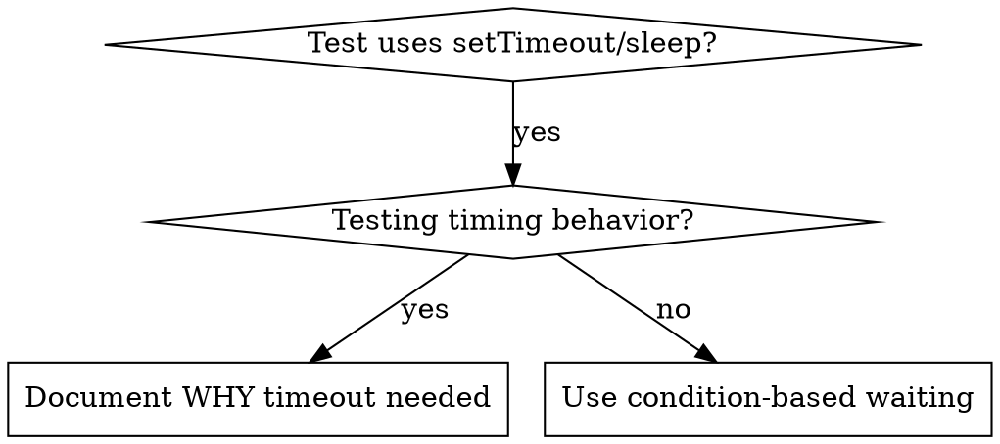

# Condition-Based Waiting

## Overview

Flaky tests often guess at timing with arbitrary delays. This creates race conditions where tests pass on fast machines but fail under load or in CI.

**Core principle:** Wait for the actual condition you care about, not a guess about how long it takes.

## When to Use



**Use when:**
- Tests have arbitrary delays (`setTimeout`, `sleep`, `time.sleep()`)
- Tests are flaky (pass sometimes, fail under load)
- Tests timeout when run in parallel
- Waiting for async operations to complete

**Don't use when:**
- Testing actual timing behavior (debounce, throttle intervals)
- Always document WHY if using arbitrary timeout

## Core Pattern

```typescript
// ❌ BEFORE: Guessing at timing
await new Promise(r => setTimeout(r, 50));
const result = getResult();
expect(result).toBeDefined();

// ✅ AFTER: Waiting for condition
await waitFor(() => getResult() !== undefined);
const result = getResult();
expect(result).toBeDefined();
```

## Quick Patterns

| Scenario | Pattern |
|----------|---------|
| Wait for event | `waitFor(() => events.find(e => e.type === 'DONE'))` |
| Wait for state | `waitFor(() => machine.state === 'ready')` |
| Wait for count | `waitFor(() => items.length >= 5)` |
| Wait for file | `waitFor(() => fs.existsSync(path))` |
| Complex condition | `waitFor(() => obj.ready && obj.value > 10)` |

## Implementation

Generic polling function:
```typescript
async function waitFor<T>(
  condition: () => T | undefined | null | false,
  description: string,
  timeoutMs = 5000
): Promise<T> {
  const startTime = Date.now();

  while (true) {
    const result = condition();
    if (result) return result;

    if (Date.now() - startTime > timeoutMs) {
      throw new Error(`Timeout waiting for ${description} after ${timeoutMs}ms`);
    }

    await new Promise(r => setTimeout(r, 10)); // Poll every 10ms
  }
}
```

See @example.ts for complete implementation with domain-specific helpers (`waitForEvent`, `waitForEventCount`, `waitForEventMatch`).

For detailed patterns, implementation guide, and common mistakes, see @references/patterns-and-implementation.md

## Real-World Impact

From debugging session (2025-10-03):
- Fixed 15 flaky tests across 3 files
- Pass rate: 60% → 100%
- Execution time: 40% faster
- No more race conditions

## Agent Operational Waits (trusty-mpm, issue #7723)

The principle above applies to your own turns, not only to test code. Your
turn ends the moment you stop emitting tool calls, and that stop IS your
result to the PM — nothing wakes you afterward; only the PM's `SendMessage`
resumes you. NEVER end a turn narrating an intention to wait ("I'll wait for
the pull to finish", "monitoring in the background") — that strands the task
until a human notices, and FOREGROUND `sleep` is blocked in this harness.

**Use `tm wait` instead of a fixed timer.** It polls the actual condition in a
bounded slice and returns before the harness's ~120s auto-background ceiling,
so you re-issue the same command instead of parking:

```bash
tm wait --for run   --pid <n>                            --timeout <secs>  # a process exits
tm wait --for file  --path <file> [--contains <literal>] --timeout <secs>  # a sentinel appears
tm wait --for check --pr <n> [--repo <owner/repo>]       --timeout <secs>  # CI settles — never --watch, never bucket alone
```

Exit codes: `0` (`status=met`) is terminal — continue. `75` (`status=pending`)
is NOT terminal — the printed line names the exact `rerun=` command and the
remaining budget; re-issue it verbatim (the `--timeout` budget spans
invocations; a retyped command that drops `--timeout` resets a deadline that
must not reset). `1` (`status=timeout`) is terminal — report the timeout
itself and stop. `2` (`status=error`) is a usage mistake or four failed
probes in a row — fix the invocation rather than retrying it blind.

**No `tm` on PATH?** Fall back to a hand-rolled until-loop, backgrounding the
waiter too since foreground `sleep` is blocked either way. Redirect into your
own scratchpad directory (given at the top of your system prompt), never a
fixed `/tmp` name — the scratchpad is SHARED across concurrently dispatched
agents, so a fixed filename lets a sibling's write clobber or shadow yours.
Name the file for THIS task and step — `op-<issue>-<step>.txt` — and read back
that exact path:

```bash
# both calls use run_in_background; then read the sentinel file
<long-command> > <scratchpad>/op-7287-install.txt 2>&1
until grep -q DONE <scratchpad>/op-7287-install.txt; do sleep 10; done; echo READY
```

🔴 Never `$$`, and never a glob. `$$` is a different PID in every Bash call
here — one agent wrote `fmt-68810.txt` and read `fmt-71275.txt` — so the write
and the read resolve to different files, and the `fmt-*.txt` glob reached for
next matches a sibling agent's output instead (#7287).

Genuinely cannot finish in-turn? REPORT STATE AND STOP — "Still pending: head
SHA abc1234, 10 checks unsettled" is a CORRECT and complete outcome; the
failure is never stopping, it is stopping while implying you will continue.
Never re-issue a long-running command because a shell call returned early:
foreground bash caps near 120s and auto-backgrounds, so check whether the
original is still running before starting a second — a duplicate 17-minute
build or VM run is the failure mode.
