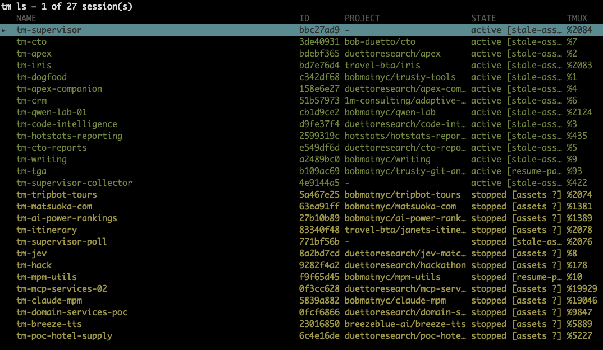
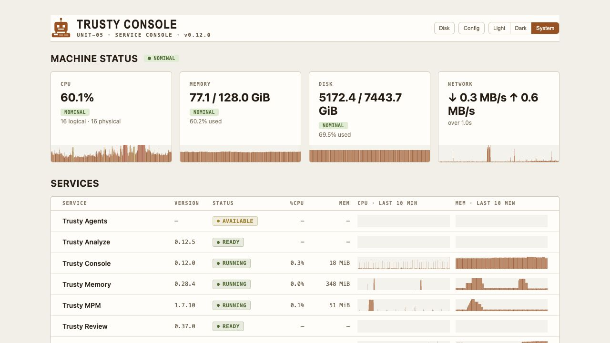
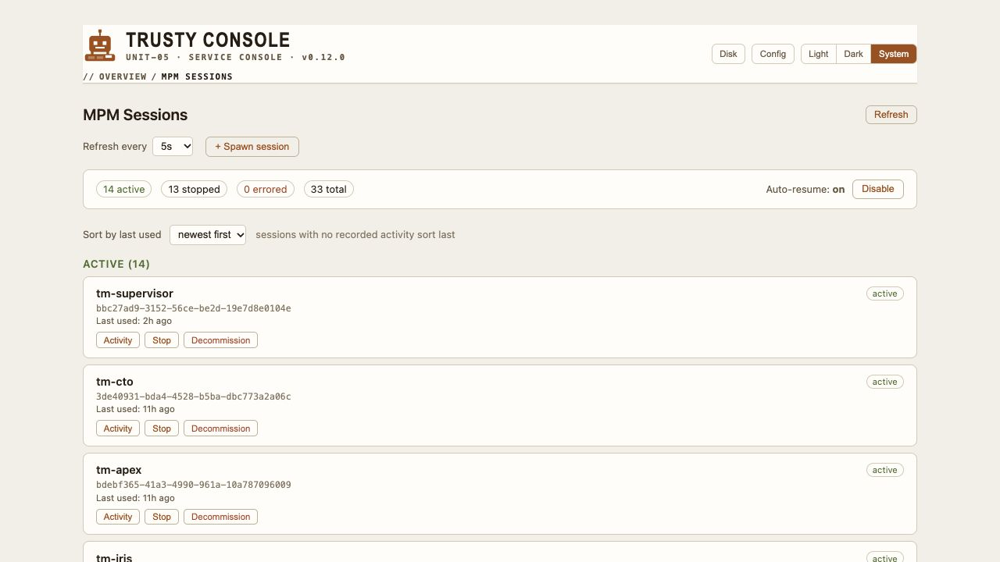

# Why Trusty-MPM

Bob Matsuoka / Duetto Engineering  
October 2, 2026

[Animated presentation](presentation.html)

Open the HTML in a browser with the assets folder beside it. Space or Right reveals each step. Shift+Right advances to the next slide. N opens notes, F requests fullscreen, A pauses moving packets, and B blacks out the screen.

## 1. TRUSTY-MPM

Architecture, engineering workflow, and the local service ecosystem

Engineering process  
around the agents

Bob Matsuoka   /   Duetto Engineering

October 2, 2026


<details>
<summary>Speaker notes and sources</summary>

Welcome. This is a target-architecture presentation for the engineering team. Open with the role of workflow and process in agentic engineering. The talk is 32 slides. About 25–30 minutes including a four-minute console demo.

- https://github.com/bobmatnyc/trusty-tools/blob/e851255df4/README.md

</details>

## 2. Why meta-harnesses matter

Meta-harnesses are now common. Workflow and process carry much of the value.

Ticketed plan

Scope and acceptance

PM orchestrator

Delegation and context

Coding agents

Implementation

Review and verification

The model executes work. The harness carries the engineering process.

<details>
<summary>Speaker notes and sources</summary>

A meta-harness coordinates work around a coding agent: what to work on, who should do it, which evidence to retrieve, how to review it, and what counts as done. Orchestrator-worker and evaluator-optimizer patterns appear in Anthropic guidance, and OpenAI describes multi-agent manager and handoff patterns. The emphasis on engineering process is our framing, rather than a quantified industry claim.

- https://www.anthropic.com/engineering/building-effective-agents
- https://openai.com/business/guides-and-resources/a-practical-guide-to-building-ai-agents/

</details>

## 3. Why I wrote my own harness

Reliable output depends on feedback the agent can act on.

“The most sure-fire way to achieve this is to give the agent fast, high quality tools to automatically tell it when it is wrong.”

Mitchell Hashimoto, HashiCorp co-founder and Ghostty creator  
My AI Adoption Journey / Engineer the Harness

My goal: turn recurring failures into better instructions,  
independent review, and verification the agents can use.

Trusty has been my primary driver since June 2026.

<details>
<summary>Speaker notes and sources</summary>

Verbatim 24-word quote from Mitchell Hashimoto’s My AI Adoption Journey, February 5, 2026, Step 5: Engineer the Harness, verified October 2, 2026. The preceding sentence explains that efficient agents produce the right result with minimal touch-ups. His examples are better implicit prompting in AGENTS.md and programmed tools such as screenshots and filtered tests. His stated goal is engineering a lasting improvement when an agent makes a mistake. The main point is therefore harness tuning as engineering work that creates actionable feedback and reduces repeated failures. Hashimoto co-founded HashiCorp and created Ghostty, verified on his personal homepage. Bob’s rationale and June 2026 adoption note remain his own.

- https://mitchellh.com/writing/my-ai-adoption-journey
- https://mitchellh.com/

</details>

## 4. Harness engineering and delegation

My view: the two most important engineering skills of the next five years.

Harness engineering

Context and tools  
Workflow and durable state  
Review and verification

Delegation

Outcome decomposition  
Ownership and acceptance criteria  
Evidence and judgment

Better outcomes depend on both the operating system for the work and how we delegate it.

<details>
<summary>Speaker notes and sources</summary>

Bob’s explicitly stated outlook for 2026–2031. Treat this as his engineering judgment. Harness engineering means designing the context, tools, workflow, state, and verification around the model. Delegation means decomposing outcomes, assigning ownership, specifying contracts, and judging evidence from independent work. This is a skills thesis, not a labor-market forecast backed by quantitative research.


</details>

## 5. Customization makes the harness yours

Engineers can adapt an existing harness to fit their workflow.

Prompting

Tell the harness how you work.  
Set expectations and acceptance criteria.

Direct artifact edits

Adapt instructions and agent definitions.  
Shape skills, ticket templates, and specs.

The workflow determines what you customize.

You can customize a harness without building one from scratch.

<details>
<summary>Speaker notes and sources</summary>

Bob’s framing: engineers do not have to build their own harness. Much of harness customization is prompting. Engineers can also edit the artifacts directly: instructions, agent definitions, skills, workflow documents, ticket templates, and specifications. Start with the workflow need, change the relevant prompt or artifact, and judge the output against the acceptance criteria. This is about tailoring an existing harness, not requiring each engineer to implement a runtime.


</details>

## 6. Engineer accountability in the factory model

My assertion: the engineer’s biggest role will be accountability for harness output.

Engineer owner

Intent and acceptance  
Workflow customization

Hornet / harness

Delegated execution

Output and evidence

Review and verification

The owner judges the result and improves the harness.

Engineers own hornets because they are accountable for the output.

<details>
<summary>Speaker notes and sources</summary>

Bob’s stated thesis. In his factory model, engineers own hornets and remain accountable for the output those harnesses produce. Ownership includes defining the intended outcome, customizing the workflow, judging review and verification evidence, and addressing failures. Delegation changes how work is executed, while accountability remains with the engineer. Hornets is the terminology Bob supplied here. Do not invent a technical definition, deployment topology, or implementation status for it.


</details>

## 7. Ticket-driven engineering

An executable ticket connects intent, ownership, and observable completion.

Intent

Problem and wanted behavior

Work contract

Owner and acceptance criteria

Completion evidence

Review and real verification

A shared contract helps people and agents judge the same outcome.

The ticket is the work contract that survives every agent handoff.

<details>
<summary>Speaker notes and sources</summary>

Trusty ticketing policy sizes work by independently deliverable outcome. Each ticket states the problem or wanted behavior, decisive evidence, and one to four observable closure conditions. Epics capture decomposition and boundary. Native issue dependencies encode sequence. The process lets engineers own the implementation plan. This is an effectiveness driver, not a claim that ticket creation itself improves results.

- https://github.com/bobmatnyc/trusty-tools/blob/e851255df4/.agents/skills/tm-ticketing/SKILL.md

</details>

## 8. Spec-linked documentation

Code points back to its governing behavior and the tests that prove it.

Behavior spec

What must hold

Code documentation

Why / What / Test

Named tests

Where the contract is proven

Spec references connect the implementation to the governing section.  
The linter checks that those links resolve and follow the convention.

Intent stays discoverable at the code that implements it.

<details>
<summary>Speaker notes and sources</summary>

Read from documentation-style and DOC-38 / SPEC-SLD-02. Non-obvious code documents Why, What, and Test, with a Spec References link only where a real spec governs it. The specification states behavior, code explains rationale and mechanics, and named tests provide evidence. trusty-sld-lint validates reference grammar, anchors, and conventions; it does not prove implementation correctness. Avoid fabricated links. Show this as an effectiveness driver that supports agent context and independent review.

- https://github.com/bobmatnyc/trusty-tools/blob/e851255df4/docs/specs/spec-linked-documentation.md
- https://github.com/bobmatnyc/trusty-tools/blob/e851255df4/.agents/skills/documentation-style/SKILL.md
- https://github.com/bobmatnyc/trusty-tools/blob/e851255df4/crates/trusty-sld-lint/README.md

</details>

## 9. Spec-linked documentation in Trusty

Actual Rust excerpts from trusty-mpm’s intent-conformance gate.

front_gate.rs  /  stricter_of_with_source

```rust
/// Why: spec §5.1 / AC-16 — the conformance disposition is *combined* with the
/// standard `evaluate_autonomy_tier` decision by taking the stricter outcome.
// …
/// What: returns the stricter `Disposition` plus an [`EscalationSource`] tag —
// …
/// Test: `tests::stricter_wins_*`, `tests::run_*_proposes_default`.
pub fn stricter_of_with_source(
    conformance: Disposition,
    autonomy: Disposition,
) -> (Disposition, EscalationSource) { /* … */ }
```

Module # Spec References: SPEC-CONFORMANCE-02~draft  
intent-conformance.md, §5.1 Gate semantics

A reviewer can trace the implementation back to the rule it must satisfy.

<details>
<summary>Speaker notes and sources</summary>

Verified in the current working tree on October 2, 2026. The module-level Spec References block in front_gate.rs links SPEC-CONFORMANCE-02~draft to docs/specs/intent-conformance.md#SPEC-CONFORMANCE-02~draft (§5.1). The function excerpt is verbatim with omissions explicitly marked. Why links the rule to §5.1 / AC-16, What describes the returned result, and Test points to named test families. The spec remains marked draft in the source. The visual highlights the implemented contract, not deployment status or a migration issue.

- https://github.com/bobmatnyc/trusty-tools/blob/e851255df4/crates/trusty-mpm/src/daemon/managed_routes/front_gate.rs
- https://github.com/bobmatnyc/trusty-tools/blob/e851255df4/docs/specs/intent-conformance.md

</details>

## 10. The named test proves the contract

Actual test: an autonomy escalation survives conformance approval.

front_gate/tests.rs

```rust
#[test]
fn stricter_wins_autonomy_escalates() {
    // Conformance would auto-accept, but a T4/destructive autonomy escalation
    // must NOT be lowered (AC-16).
    let d = stricter_of(auto("conformance ok"), esc("T4: destructive"));
    assert!(!d.is_auto_accept(), "tier escalation must not be lowered");
    assert_eq!(d, esc("T4: destructive"));
}
```

AC-16: conformance never lowers a tier escalation.  
Both the reason and the resulting disposition must survive.

The spec states the rule. The code documents it. The test checks the behavior.

<details>
<summary>Speaker notes and sources</summary>

Verbatim test from front_gate/tests.rs lines 203–210, verified in the working tree. The governing spec §5.1 and AC-16 say conformance must not lower an autonomy escalation. The documentation names stricter_wins_* and this exact test is one member. This slide shows test code, not a claim that the suite was executed in this presentation task. The enum and helper names are preserved.

- https://github.com/bobmatnyc/trusty-tools/blob/e851255df4/crates/trusty-mpm/src/daemon/managed_routes/front_gate/tests.rs
- https://github.com/bobmatnyc/trusty-tools/blob/e851255df4/docs/specs/intent-conformance.md

</details>

## 11. The ticketing agent and epic skill

Maciek’s PR #8412 gives the harness a reusable way to organize epic and phase work.

Ticketing agent

Epic / Phase guidance  
points to the skill

tm-epic skill

Tracker + phase templates  
Procedure and anti-patterns

Linked tickets

One outcome tracker  
Linked phase issues

Credit: Maciek Klimkowski / mac-duetto, PR #8412

Real example: epic #8445 with phase tickets #8447 and #8448.

Agent instructions and reusable skill artifacts make the ticket workflow consistent.

[Open the agent and skill improvements](https://github.com/bobmatnyc/trusty-tools/pull/8412)

<details>
<summary>Speaker notes and sources</summary>

User clarified the focus is the ticketing agent and skill improvements. GitHub PR #8412 is authored by Maciek Klimkowski (mac-duetto). It adds the tm-epic skill with tracker and phase templates, manual-procedure and anti-patterns references, connects the ticketing agent Epic/Phase section to {{TM_SKILLS}}/tm-epic/SKILL.md, and cross-references the tm-ticketing skill. Credit this artifact customization rather than presenting only the later CLI feature. Epic #8445 is a real later example by the same author with phases #8447 and #8448. This is a concrete example of engineers adapting reusable agent and skill artifacts to their workflow.

- https://github.com/bobmatnyc/trusty-tools/pull/8412
- https://github.com/bobmatnyc/trusty-tools/issues/8445

</details>

## 12. Labels make the plan queryable

Classification gives the harness a consistent way to select, route, and track work.

Type

bug, enhancement, refactor, chore, documentation, epic

Component

The owning crate or subsystem

Priority and workstream

Explicit P0–P3 severity and ws/<session> association

Lifecycle

status:in-progress

status:coded

status:merged

status:tested

The harness can ask: which work is ready, who owns it, and what evidence is missing?

<details>
<summary>Speaker notes and sources</summary>

The exact schema is project-configurable. Trusty issue policy specifies type, owning component, and optional explicit priority. ws/<session> associates a workstream. Lifecycle labels are mutually exclusive and advanced by a validated transition command. A merged PR does not alone satisfy the live verification close bar. Do not imply the Duetto project has exactly the same type vocabulary as the Trusty repository.

- https://github.com/bobmatnyc/trusty-tools/blob/e851255df4/.agents/skills/tm-ticketing/SKILL.md
- https://github.com/bobmatnyc/trusty-tools/blob/e851255df4/issue-state.yaml

</details>

## 13. Duetto: APEX Effectiveness

Engineering-driven ticketing turns a complex plan into work the team can execute.

APEX + APEX Companion

Merge friction

Workstream

Notifications

Workstream

Companion UX

Workstream

Data quality

Workstream

Delivery milestones

Unblock housekeeping

Inform, don’t approve

Hackathon week

Engineers shape the implementation plan, dependencies, and delivery evidence.

[Open APEX Effectiveness](https://github.com/orgs/duettoresearch/projects/26)

<details>
<summary>Speaker notes and sources</summary>

Live-read through bob-duetto GitHub account on October 2, 2026. GitHub Project 26 is APEX Effectiveness, spanning duettoresearch/APEX and duettoresearch/apex-companion. Its 57 items include issues and PRs; this is not a claim of 57 open tickets. Actual workstreams and milestone names shown here come from the project. Engineering-driven ticketing is Bob’s stated direction. Explain how a harness can maintain a plan this complex, not a claim that every card was created by a particular automation.

- https://github.com/orgs/duettoresearch/projects/26

</details>

## 14. claude-mpm architecture

A Python meta-harness around Claude Code with an event-driven web monitor.

Python meta-harness

Instructions, agents, skills

Claude Code

PM and specialist sessions

Python hook handler

Lifecycle events

Web monitor

aiohttp + Socket.IO

Python runtime and package  
configuration on the hook path

PM delegation and specialist agents are the shared product model.

<details>
<summary>Speaker notes and sources</summary>

Baseline is the local claude-mpm checkout at 25203d34f, not an invented legacy architecture. The monitor combines aiohttp and python-socketio in a persistent process. The hook installer locates a Python interpreter and runs the hook script. Both systems share the PM-and-specialists product model. Do not claim claude-mpm lacks a resident monitor or event-driven behavior.

- https://github.com/bobmatnyc/claude-mpm/blob/25203d34f/src/claude_mpm/services/monitor/server.py
- https://github.com/bobmatnyc/claude-mpm/blob/25203d34f/src/claude_mpm/hooks/claude_hooks/installer.py

</details>

## 15. trusty-mpm architecture

One central tm daemon knows the projects and sessions across the system.

Operator interfaces

CLI, TUI, MCP, Console

Resident tm daemon

Shared session registry and supervision

tmux sessions

Native tmux + project worktrees

Agent / skill catalog

Specialist instructions

Shared local services

Search, memory, review

One session manager has a system-wide view. Every managed session runs in tmux.

<details>
<summary>Speaker notes and sources</summary>

Target architecture per ADR-0032: local inter-service traffic uses UDS and console extends it to the browser. tm is the primary executable for CLI, daemon, MCP, TUI, supervisor, and messaging surfaces. Managed sessions run a coding runtime in tmux with project/worktree isolation. The daemon is not the LLM and does not replace the coding runtime.

- https://github.com/bobmatnyc/trusty-tools/blob/e851255df4/docs/adr/0032-no-service-owns-http-console-is-the-only-http-surface.md
- https://github.com/bobmatnyc/trusty-tools/blob/e851255df4/crates/trusty-mpm/README.md
- https://github.com/bobmatnyc/trusty-tools/blob/e851255df4/docs/architecture/harnesses.md

</details>

## 16. tm ls manages ordinary tmux sessions

An internal session manager adds a shared view across projects. Native tmux still works.



Shared view

Projects  
Session state  
Tmux targets

Native tmux  
list-sessions  
attach-session

tm ls adds orchestration. Native tmux remains available for direct session access.

<details>
<summary>Speaker notes and sources</summary>

User-supplied tm ls screenshot, captured October 2, 2026. Preserve it as supplied. It displays the session name, project, state, and TMUX target. These are real tmux sessions, not a separate terminal runtime. Engineers can use tm ls for the managed view or native tmux to list, attach, switch, and detach. A single central tm daemon owns the shared managed-session registry and supervision. The supporting search and memory services keep their own service ownership, so do not describe every service as code running inside one daemon process.

- https://github.com/bobmatnyc/trusty-tools/blob/e851255df4/crates/trusty-mpm/src/core/session_launch/mod.rs

</details>

## 17. Trusty and standalone Claude Code coexist

Managed projects and configuration live in Trusty’s configured directories.

Trusty-managed sessions

Configured project directory  
Dedicated Claude configuration  
Trusty agents, skills, and hooks  
Managed tmux sessions

Standalone Claude Code

Normal project launch  
Standard global configuration  
Its own instructions and hooks

Managed launch: CLAUDE_CONFIG_DIR selects the Trusty configuration.

Trusty hooks run for Trusty-managed sessions. Standalone Claude Code keeps its own configuration.

<details>
<summary>Speaker notes and sources</summary>

Target operating model requested by the user. Managed launches set CLAUDE_CONFIG_DIR to the tm-owned configuration directory. core/managed_config.rs documents the shared managed base ~/.trusty-tools/trusty-mpm/claude-config/. Projects live under the configured Trusty project root, such as the presenter’s trusty-mpm-projects directory. This isolates the managed harness configuration, agents, skills, and hooks from ordinary global Claude Code defaults. Trusty hooks belong to Trusty-managed launches. Standalone Claude Code launched normally uses its own default configuration. This is configuration isolation, not a claim that two sessions modifying the same repository files cannot conflict.

- https://github.com/bobmatnyc/trusty-tools/blob/e851255df4/crates/trusty-mpm/src/core/managed_config.rs
- https://github.com/bobmatnyc/trusty-tools/blob/e851255df4/crates/trusty-mpm/src/core/session_launch/mod.rs

</details>

## 18. Major architectural differences

The orchestration model persists. Its runtime and service boundaries change.

claude-mpm

trusty-mpm

Python harness and package runtime

Native Rust tm executable and resident daemon

Python lifecycle hook handler

Native hook command and shared daemon state

HTTP + Socket.IO monitor

Console gateway and local service RPC

Harness configuration and integrations

Shared search, memory, analysis, and review services

The separation of orchestration, intelligence services, and browser access is explicit.

<details>
<summary>Speaker notes and sources</summary>

Compare architecture rather than unsupported performance numbers. A native Rust hook still starts a short-lived process; it removes Python interpreter and import setup from that path. Target service topology favors shared, single-owner local services and a separate browser gateway. Both designs are event-driven.

- https://github.com/bobmatnyc/trusty-tools/blob/e851255df4/crates/trusty-mpm/README.md
- https://github.com/bobmatnyc/trusty-tools/blob/e851255df4/docs/adr/0032-no-service-owns-http-console-is-the-only-http-surface.md
- https://github.com/bobmatnyc/claude-mpm/blob/25203d34f/src/claude_mpm/services/monitor/server.py

</details>

## 19. Why we switched to Rust

Performance drove the choice across search, memory, and the core trusty-mpm daemon.

Search

Fast retrieval across resident repository indexes

Memory

Low-overhead storage, recall, and shared knowledge state

Core tm daemon

Responsive session coordination and event handling

Native code reduces interpreter overhead.  
The daemon keeps expensive state ready between requests.

Compiled hot paths and resident shared state support a responsive engineering harness.

<details>
<summary>Speaker notes and sources</summary>

The migration rationale is supplied directly by Bob: search and memory performance, plus the core trusty-mpm daemon. Rust compiles the service and its hot paths to native code, removing Python interpreter overhead from those paths. It also supports explicit data ownership and concurrent resident services. These are engineering opportunities, not a universal language speedup guarantee: Python libraries often call native code too, and architecture, algorithms, and caching materially affect results. Search is the measured illustration on the next slide. No matched memory or core-daemon benchmark was established for this deck.

- https://github.com/bobmatnyc/trusty-tools/blob/e851255df4/docs/trusty-search/research/trusty-search-vs-mcp-vector-search-2026-05-12.md

</details>

## 20. Search illustrates the performance goal

Historical May 2026 comparison, with measurement boundaries shown explicitly.

Rust / trusty-search

13–16 ms

Observed warm hybrid query p50  
1,282 chunks / M-series Mac

Python / mcp-vector-search

40–85 ms

Reported warm MCP requests  
Different workload and methodology

Illustrative historical results, not a matched language benchmark.  
Resident service design contributes alongside compiled execution.

The goal is fast retrieval on every agent turn, with indexes and models already resident.

<details>
<summary>Speaker notes and sources</summary>

Source: docs/trusty-search/research/trusty-search-vs-mcp-vector-search-2026-05-12.md Performance section, and docs/trusty-search/regression-testing/search-perf-2026-05-12.md. Rust warm hybrid query p50 was observed as 13–16 ms on a 1,282-chunk Rust crate on an M-series Mac. Python mcp-vector-search warm MCP server 40–85 ms was published/claimed, not measured in the same test. This is not a controlled benchmark or proof of a language-only speedup. Architecture matters: the machine-wide Rust daemon amortizes model loading and index residency; the Python comparison has per-project processes and a 4–9 second reported CLI cold start. Omit a computed speedup ratio. Memory and tm daemon performance are rationale, not quantified results here.

- https://github.com/bobmatnyc/trusty-tools/blob/e851255df4/docs/trusty-search/research/trusty-search-vs-mcp-vector-search-2026-05-12.md
- https://github.com/bobmatnyc/trusty-tools/blob/e851255df4/docs/trusty-search/regression-testing/search-perf-2026-05-12.md

</details>

## 21. A lifecycle event’s journey

The native command forwards the event to the resident orchestration service.

claude-mpm

Lifecycle event

Python handler

Monitor / state

trusty-mpm

Lifecycle event

tm hook

Resident daemon

Routing and supervision

Event routing stays local. The daemon owns shared orchestration state.

<details>
<summary>Speaker notes and sources</summary>

Conceptual comparison of lifecycle-event processing. tm hook is still invoked as a process. Shared state lives in the resident daemon. Transport shown is target UDS for same-host daemon calls. No latency benchmark or exact process-count claim is implied. Python source shows interpreter selection and hook execution.

- https://github.com/bobmatnyc/trusty-tools/blob/e851255df4/crates/trusty-mpm/src/daemon/socket.rs
- https://github.com/bobmatnyc/claude-mpm/blob/25203d34f/src/claude_mpm/hooks/claude_hooks/installer.py

</details>

## 22. Target architecture

Unix sockets connect local services. Trusty Console is the single HTTP gateway.

Browser / webhook

HTTP

Trusty Console

Gateway, dashboards, health

MPM

Resident orchestration

Search

Shared repository indexes

Memory

Shared durable knowledge

Analyze / Review

On-demand analysis / review

Local UDS RPC

MCP clients connect over stdio

Local service ownership stays behind one browser-facing boundary.

<details>
<summary>Speaker notes and sources</summary>

This diagram depicts the accepted target architecture only, as requested. ADR-0032 plus amendments ADR-0034 and ADR-0035. Resident storage/intelligence services have shared writers. Analyze is on demand; review runs per invocation or webhook delivery. External LLM provider calls remain outbound HTTPS and are separate from same-host IPC. Console gateway does not own service business behavior.

- https://github.com/bobmatnyc/trusty-tools/blob/e851255df4/docs/adr/0032-no-service-owns-http-console-is-the-only-http-surface.md
- https://github.com/bobmatnyc/trusty-tools/blob/e851255df4/docs/adr/0034-webhook-ingress-console-relays-over-uds-to-a-supervised-on-demand-process.md

</details>

## 23. Networking by purpose

Each boundary has a transport that matches the caller.

MCP over stdio

Coding runtime connects to tool servers

Unix domain sockets

Local processes share service owners and durable state

Console HTTP

Browser dashboards, aggregated health, webhook ingress

Outbound HTTPS

Model providers and external integrations

MCP is the tool protocol. UDS is local IPC. HTTP serves the browser.

<details>
<summary>Speaker notes and sources</summary>

MCP uses JSON-RPC over standard input and output. Stateless bridges route work into local service owners. UDS means Unix domain sockets, not UDP. Hardened sockets use protected directories, socket modes, and same-user peer checks. Browser and webhook access terminates in Console. Provider calls go to remote endpoints over HTTPS. This is target architecture and purpose, not a universal API endpoint inventory.

- https://github.com/bobmatnyc/trusty-tools/blob/e851255df4/crates/trusty-mcp/README.md
- https://github.com/bobmatnyc/trusty-tools/blob/e851255df4/docs/adr/0032-no-service-owns-http-console-is-the-only-http-surface.md
- https://github.com/bobmatnyc/trusty-tools/blob/e851255df4/docs/reference/threat-model.md

</details>

## 24. Search finds the relevant code

Exact names, conceptual meaning, and code relationships feed one ranked result set.

Question

“Where is retry handled?”

BM25

Exact words and symbols

Semantic

Related concepts

Code graph

Callers and dependencies

Rank fusion

Relevant code context

One query can find both the symbol and the surrounding implementation context.

<details>
<summary>Speaker notes and sources</summary>

trusty-search provides lexical BM25, vector semantic search, and knowledge-graph expansion fused through reciprocal rank fusion. Query intent affects routing, and graph expansion is intent-gated rather than always running for every query. Named indexes, incremental indexing, branch context, and MCP access support multiple repositories. Avoid unsupported performance numbers.

- https://github.com/bobmatnyc/trusty-tools/blob/e851255df4/crates/trusty-search/README.md

</details>

## 25. Memory retains engineering knowledge

Decisions and lessons remain retrievable across sessions and projects.

Experience

Decision, incident, convention

Project palace

Scoped durable knowledge

Knowledge and facts

Relations and prompt context

Recall

Context for the next task

Preserve why a decision was made, then retrieve it when a later task needs it.

<details>
<summary>Speaker notes and sources</summary>

trusty-memory is organized into named palaces, wings, rooms, and drawers. It combines semantic retrieval with structured knowledge graph facts, prompt facts, and progressive recall. Durable metadata is backed by redb and HNSW vector search. Consolidation is a supported optional feature, not a guarantee that every review finding is automatically stored. A memory should preserve source and context, and retrieved facts should be checked when they can drift.

- https://github.com/bobmatnyc/trusty-tools/blob/e851255df4/crates/trusty-memory/README.md

</details>

## 26. Search and memory supply different evidence

Search explains the code. Memory explains the decisions around it.

Search

“This function commits the cursor.”  
Current repository evidence

Memory

“Only commit after durable storage succeeds.”

Task context

Code + intent + acceptance criteria

The agent receives implementation evidence and the reasoning behind the design.

<details>
<summary>Speaker notes and sources</summary>

Illustrative retrieval example. Search supplies current repository evidence; memory supplies prior intent, conventions, and lessons. Treat memory as historical context with provenance, not authority overriding the working tree. Both contribute to an informed agent context. trusty-kb provides a deterministic Markdown knowledge tree, distinct from semantic memory storage.

- https://github.com/bobmatnyc/trusty-tools/blob/e851255df4/crates/trusty-search/README.md
- https://github.com/bobmatnyc/trusty-tools/blob/e851255df4/crates/trusty-memory/README.md
- https://github.com/bobmatnyc/trusty-tools/blob/e851255df4/crates/trusty-kb/README.md

</details>

## 27. Review assembles an informed assessment

trusty-review combines the diff with repository context and static analysis.

PR / local diff

Changed behavior

Search context

Surrounding implementation

Static analysis

Complexity and quality

trusty-review

Model-backed assessment

Findings

Evidence and fixes

Review becomes more useful when it can see beyond the changed lines.

<details>
<summary>Speaker notes and sources</summary>

trusty-review fetches a PR diff or consumes a local diff, retrieves code context through search, obtains complexity and quality context from analyze, and invokes an LLM to produce structured findings. It supports Bedrock and OpenRouter. It runs per invocation or webhook delivery. CLI is dry-run by default and posting requires an explicit live flag. Optional context degrades gracefully if unavailable. Distinguish the service from the code-critic agent used in the delivery pipeline.

- https://github.com/bobmatnyc/trusty-tools/blob/e851255df4/crates/trusty-review/README.md
- https://github.com/bobmatnyc/trusty-tools/blob/e851255df4/crates/trusty-analyze/README.md

</details>

## 28. The code critic challenges the implementation

An independent specialist reviews the specification and the code.

Specification

Behavior and acceptance

Implementation

Diff and code evidence

Independent critic

Severity + confidence  
Production failure scrutiny

APPROVE

No critical or high

WARN

High findings travel

BLOCK

Critical finding halts

Every finding needs evidence, an actionable fix, and a disposition.

<details>
<summary>Speaker notes and sources</summary>

Read against code-review-standards. The critic avoids implementer reasoning to reduce anchoring bias. Findings include severity, file and line, what breaks, concrete fix, and disposition. It applies an over-80% confidence filter. APPROVE means no CRITICAL or HIGH findings. WARN means at least one HIGH and no CRITICAL, and findings travel with the handoff. BLOCK means any CRITICAL and halts for direction. This is the specialist agent and rubric, not another standalone crate or a promise of bug-free code.

- https://github.com/bobmatnyc/trusty-tools/blob/e851255df4/.agents/skills/code-review-standards/SKILL.md

</details>

## 29. The engineering feedback loop

Acceptance criteria and evidence connect implementation to completion.

Implement

Critique

Resolve

Verify

Repair and re-review when needed

A merged change earns completion through verification evidence.

<details>
<summary>Speaker notes and sources</summary>

Conceptual pipeline: implement, independent critique, fix or decide, verify, then complete the issue through the configured lifecycle. The critic does not file every observation as a new issue; findings can be fixed in the current PR, retained on the parent, or recommended for promotion. Curated lessons may be stored in memory. This slide illustrates engineering workflow, not migration or transitional architecture.

- https://github.com/bobmatnyc/trusty-tools/blob/e851255df4/.agents/skills/tm-ticketing/SKILL.md
- https://github.com/bobmatnyc/trusty-tools/blob/e851255df4/.agents/skills/code-review-standards/SKILL.md

</details>

## 30. Trusty Console

One browser entry point for the local service fleet.



Fleet health

Services  
CPU / memory  
Capabilities

Fleet status stays visible. Each service keeps ownership of its behavior.

[Open live Trusty Console](http://127.0.0.1:7788/)

<details>
<summary>Speaker notes and sources</summary>

Real console screenshot captured October 2, 2026. Explain running versus available/on-demand service states. The overview displays status and resources; service dashboards contain management. Actual screenshot is narrow because it comes from the app browser. It is a fallback for a live browser demonstration. Do not present resource samples as benchmarks.

- https://github.com/bobmatnyc/trusty-tools/blob/e851255df4/crates/trusty-console/README.md
- http://127.0.0.1:7788/

</details>

## 31. Console walkthrough

Fleet overview, managed sessions, then activity.



01  Fleet

02  Sessions

03  Activity

The console makes orchestration observable to the engineering team.

[Begin the live walkthrough](http://127.0.0.1:7788/)

<details>
<summary>Speaker notes and sources</summary>

Four-minute demo. 1. Open console overview and distinguish running services from ready/on-demand tools. 2. Click Trusty MPM to show sessions and status. 3. Open an existing session Activity view. 4. Return to overview and inspect Search or Memory dashboard as time permits. Use read-only navigation, avoid stop/resume/spawn actions during this presentation. The screenshot is a fallback. Session status comes from the current live UI rather than the target topology diagram.

- http://127.0.0.1:7788/
- https://github.com/bobmatnyc/trusty-tools/blob/e851255df4/crates/trusty-console/ui/src/sessionRows.js

</details>

## 32. Where we’re going

The same engineering orchestration model, with more model choice.

trusty-code

MPM’s orchestration model  
with open-weight model backends

Keep the workflow, ticketing, context, critique,  
and verification. Broaden the model choices.

2027 expectation: open-weight models become a practical route to control frontier-model costs.

<details>
<summary>Speaker notes and sources</summary>

Bob’s stated product direction: trusty-code aims to provide the same orchestration model as MPM while enabling open-weight models. 2027 is Bob’s expectation for practical use to counter frontier-model costs, not a confirmed delivery commitment or a measured cost claim. Preserve the same ticketing, context retrieval, critic, and verification process regardless of model backend. No claim of equivalent model quality is implied.

- https://github.com/bobmatnyc/trusty-tools/blob/e851255df4/crates/trusty-code/README.md

</details>
