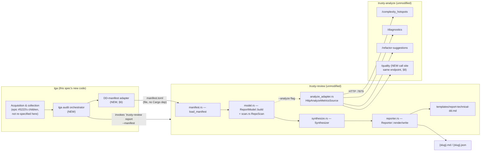

# DOC-67 — tga AUDIT Mode: Remote Codebase Analysis for Acquisition Due Diligence

**Status:** APPROVED 2026-08-08. The owner signed off §3's dimension-scope
assumption and every open question (Q1–Q6) is resolved. Implementation was
HELD until tm 1.3.5 shipped — owner directive, 2026-08-08: *"yes, hold off on
building until we release 1.3.5."* **The owner lifted that hold on
2026-08-13 ([#5643](https://github.com/bobmatnyc/trusty-tools/issues/5643));
the §13 issues may be filed and implementation may begin.**
**Spec ID:** `SPEC-TGAUDIT-01~draft` … `SPEC-TGAUDIT-13~draft`
**Subsystem:** `trusty-git-analytics` (tga) — orchestration, new `audit`
subcommand, DD-manifest adapter; `trusty-review` — existing DD report
pipeline, consumed unmodified; `trusty-analyze` — existing HTTP analysis
surface, consumed unmodified by trusty-review, not touched by tga
**Owner:** Bob Matsuoka
**Last-updated:** 2026-08-13 (implementation hold lifted, #5643)
**DOC-N claim:** `DOC-67`, scan-before-claim per DOC-38 §4.1. Verified against
this worktree (branched from `origin/main`): no `DOC-67` filename or
header self-label anywhere under `docs/specs/**`; `scripts/check_doc_numbers.sh`
reports 106 docs / 100 claims, 4 grandfathered, 0 violations before this file
was added; `docs/specs/README.md`'s own catalog note (updated 2026-08-05)
names `DOC-67` as the next free number after `DOC-66`. Open-PR claims cannot
be scanned by the script (documented limitation); a `gh pr list` sweep for
`DOC-67`/`DOC-68` across currently open PRs found no match.
**Builds on:** none — greenfield. Depends operationally (not as a spec
citation) on epic [#5223](https://github.com/bobmatnyc/trusty-tools/issues/5223)
and its six children (§7), and on trusty-review's existing, unmodified report
pipeline (§5–§6), with one now-planned exception (§8's new Engineering
Velocity template section).
**Related issues:** milestone [#43](https://github.com/bobmatnyc/trusty-tools/milestone/43)
("tga Audit + Certified modes", due 2026-08-09); epic
[#5223](https://github.com/bobmatnyc/trusty-tools/issues/5223) and children
[#5215](https://github.com/bobmatnyc/trusty-tools/issues/5215),
[#5216](https://github.com/bobmatnyc/trusty-tools/issues/5216),
[#5217](https://github.com/bobmatnyc/trusty-tools/issues/5217),
[#5218](https://github.com/bobmatnyc/trusty-tools/issues/5218),
[#5219](https://github.com/bobmatnyc/trusty-tools/issues/5219),
[#5220](https://github.com/bobmatnyc/trusty-tools/issues/5220); PR
[#5209](https://github.com/bobmatnyc/trusty-tools/pull/5209) (tga TUI + progress
bus, the baseline this spec builds past); epic #2445 and PR #2452 (trusty-review
`--analyze` / `AnalyzeMetrics` adapter, consumed unmodified here); epic #2312
(trusty-review DD report pipeline, consumed unmodified here).

---

## {#SPEC-TGAUDIT-01~draft} 1. Purpose

An acquirer's technical diligence team needs a blanket read on a target
company's codebase before or during a deal: engineering velocity, code
health, and risk exposure, produced by a stranger with no prior relationship
to the target's engineering org and no manual setup. `tga audit` is one
command that points at a GitHub org, a Bitbucket workspace, or an explicit
repo list, and produces a due-diligence report an acquirer's technical
reviewer reads before making a call on the deal or its price.

The output is not a dashboard for the target's own engineers. It is a
document handed to someone outside the company, read once, under time
pressure, to answer "what are we buying." Every scope decision in this spec
resolves toward that reader.

## {#SPEC-TGAUDIT-02~draft} 2. One-Shot Execution — Binding Constraint

Owner, stated twice: *"we're trying to make this one shot"* / *"we're trying
to one shot it so it should run as is without interactivity. The only
interactivity is configuring the sources."*

`tga audit`, once invoked, runs start to finish without interrupting the
operator. No confirmation, no mid-run choice, no wait-for-input. The ONLY
interactive surface anywhere in this product is source configuration —
`tga install` or #5216's zero-config init, both of which run BEFORE `tga
audit` starts, not during it. A feature that wants to prompt mid-run
violates this principle and needs the owner to revisit it, not a spec
author to assume it's fine.

This binds every downstream design choice in this document. Two places the
original draft got it wrong, corrected below: §9's acquisition-failure
default (an abort defaults to needing a human to re-run with a flag — wrong
under one-shot, fixed to continue-and-report) and §6's metadata fields
(originally left as "CLI flag, optional" with no fallback specified — fixed
to a defined fallback so absence never blocks the run, §6).

## {#SPEC-TGAUDIT-03~draft} 3. The v1 Dimension-Scope Assumption — APPROVED

**Approved by the owner, 2026-08-08.** The assumption below is settled. It is
retained in full because it governs what the report claims and what it
refuses to claim, and because the follow-on work it defers is real.

> **AUDIT v1 renders SECURITY and ARCHITECTURE from the trusty-analyze
> surface that exists today, and declares PERFORMANCE and COST explicitly
> unavailable in the report's Gaps & Caveats section rather than fabricating
> them. Building real performance/cost/SAST dimensions is scoped as named
> follow-on work.**

This is the central decision this spec asks the owner to approve or reject.
Everything below is written on this assumption; rejecting it changes §4
(Scope), §8 (The Report), and §13 (Proposed Issue Breakdown).

**Why this assumption exists.** trusty-analyze has no performance dimension
and no cost dimension in its code today — confirmed by an empty-result grep
for `"performance"|"cost_estimate"|CostMetric|PerformanceMetric` across
`crates/trusty-analyze/src`. Its "security" signal is not a dedicated
scanner; it is whatever the general-purpose lint/style tools happen to flag
(`crates/trusty-analyze/src/core/tool_impls/mod.rs:14-36` — clippy, ruff,
biome, rubocop, phpstan, staticcheck, PMD, detekt, swiftlint, clang-tidy,
Roslyn). Building a real SAST pass, a dependency-CVE scanner, a license
scanner, and a cost/performance estimator is not a one-day extension of the
existing HTTP surface — it is new analysis capability inside trusty-analyze,
independent of who orchestrates AUDIT mode.

**What "security from what exists today" actually yields.** Two live
endpoints, unmodified: `GET /indexes/{id}/diagnostics`
(`crates/trusty-analyze/src/service/routes.rs:91-94`) and
`GET /indexes/{id}/refactor-suggestions` (`routes.rs:82-86`). trusty-review's
existing adapter (`crates/trusty-review/src/report/analyze_adapter.rs:164-186`)
maps their `error|critical` severities to RED and `warning|high` to AMBER.
Concretely, this surfaces: unhandled-error lint rules, unsafe-pattern lint
rules (e.g. clippy's `unwrap_used`, Roslyn's security-relevant analyzers where
configured), and structural refactor flags graded `high`/`critical`
(oversized functions, deep nesting) that correlate with defect density. This
is real signal and it is cheap: it requires zero new trusty-analyze code.

**What it does NOT yield, stated in the report itself, not left implicit.**
No dependency/CVE scan (no `cargo audit`/`npm audit`/`pip-audit` integration
exists in trusty-analyze). No secrets scan. No SAST in the OWASP/CWE sense —
a linter flagging `unwrap()` is not the same claim as a scanner flagging SQL
injection or a hardcoded credential. No license-risk assessment. No
penetration-test-equivalent finding. An acquirer reading a "Security"
section backed only by general-purpose linters must not conclude the
codebase has been screened for exploitable vulnerabilities — it has been
screened for the subset of coding-standard violations eleven mainstream
linters happen to flag by default. **The report says this explicitly** (§5,
§7) rather than letting the section header imply more than the data
supports.

**Architecture**, by contrast, is a closer fit to what trusty-analyze already
does well: `GET /indexes/{id}/quality` (`routes.rs:87-90`, returns
`avg_cyclomatic`/`pct_grade_a`/`smell_count`/`grade`), `complexity_hotspots`,
`smells`, and the graph/entities/clusters endpoints are architecture-shaped
by construction (structural complexity, coupling, code-smell density). This
dimension does not carry the same depth-mismatch risk as security.

## {#SPEC-TGAUDIT-04~draft} 4. Scope

**In scope for v1:**
- One `tga audit` orchestrator command driving the full existing tga data
  pipeline (collect, classify, report, pr-metrics, jira sync, dora,
  deployments, incidents) across a discovered or configured repo set (§6).
- A tga→trusty-review DD-manifest adapter (§6) that hands the discovered repo
  set to trusty-review's existing, unmodified pipeline.
- Rendering through the existing `report-technical-dd.md` template (§8):
  Report Metadata, per-application scorecard (tech stack/LoC/frameworks from
  the existing scan baseline), Findings by Severity (RED/AMBER from
  trusty-analyze diagnostics + refactor-suggestions, unchanged), the
  complexity-distribution and LoC-by-technology graph datasets (unchanged).
- An explicit Gaps & Caveats section stating what was not assessed:
  performance, cost, CVE/dependency risk, license risk, obsolescence, cloud
  readiness, remediation economics, peer-benchmark position — none of these
  have a data source today (§3, §5, §8).
- A data-handling statement referencing #5218's no-content attestation (§10).

**Out of scope for v1 (named follow-on work, not silently dropped):**
- A real performance dimension in trusty-analyze (profiling, runtime-cost
  scoring).
- A real cost dimension (cloud-spend estimation, remediation-cost modeling).
- A real security dimension beyond linter output: SAST, dependency/CVE
  scanning, secrets scanning, license scanning.
- Peer-benchmark corpus population for the Scorecard's "Benchmark Position"
  table.
- DORA/velocity metrics as a first-class DD report section (§8, §12 Q3) —
  tga already computes these; the template has no place for them yet.
- Certified mode (§11 — recorded, not designed).

**Explicitly deferred, tracked elsewhere, not restated here:** repo
acquisition/cloning (#5215), zero-config org/workspace init (#5216), the
"Run Audit" full-dataset orchestrator work itself insofar as it is scoped by
#5217, database inspection/no-content attestation (#5218), JIRA/GitHub-
Issues/Linear `work_items` writers (#5219), Bitbucket discovery (#5220). This
spec depends on that epic; it does not re-describe or duplicate its scope
(§7 states precisely how AUDIT's orchestrator differs from and depends on
each child).

## {#SPEC-TGAUDIT-05~draft} 5. Architecture

Three existing systems, three seams, no second implementation of any of
them. Per root `CLAUDE.md`'s common-entry-point rule: a capability that
already has exactly one implementation must not grow a second one because a
new caller (tga) wants access to it.

**Seam 1 — tga owns acquisition and collection.** Everything under "Data
Acquisition" (org/workspace discovery, clone-on-demand, JIRA/Linear/GitHub-
Issues/Bitbucket collection into `work_items`, and the full sweep over the
data-collection subcommands) is epic
[#5223](https://github.com/bobmatnyc/trusty-tools/issues/5223)'s six children.
This spec's new orchestrator code calls into that machinery once it exists;
it does not restate it (§7).

**Executed stage order.** `tga::audit::run_full_sweep`
(`crates/trusty-git-analytics/src/audit/sweep.rs`) runs nine stages, in this
order:

1. `collect` — walk the configured repositories into `commits`.
2. `correlate` — the deterministic commit ↔ board-item join
   ([#5405](https://github.com/bobmatnyc/trusty-tools/issues/5405)). It sits
   here because every production writer of `work_items` runs inside `collect`,
   so this is the earliest point at which the join sees a complete board.
3. `classify` — the four-tier classification cascade.
4. `jira sync` — ingest JIRA transitions and comments.
5. `deployments collect` — populate `fact_deployments`.
6. `incidents collect` — populate `fact_incidents`.
7. `dora` — reduce those two fact tables to the four DORA keys.
8. `pr-metrics` — aggregate pull-request metrics per engineer.
9. `report` — render the CSV / JSON / Markdown reports.

This is data-flow order, and it deliberately replaces the order this section
carried until
[#5306](https://github.com/bobmatnyc/trusty-tools/issues/5306) — `collect →
classify → report → pr-metrics → jira → dora → deployments → incidents` — which
cannot execute as written: `dora` reduces the two tables `deployments` and
`incidents` populate after it (§8), and `report` renders what the five stages
following it produce.

The order is asserted, not only described. `EXPECTED_ORDER` in
`crates/trusty-git-analytics/src/audit/tests.rs` holds the same nine stages, and
`audit::tests::sweep_runs_every_stage_in_order_and_survives_failures` fails if
`run_full_sweep`'s body departs from it — so this list and the code cannot drift
apart silently.

**Seam 2 — trusty-review owns rendering.** `manifest.rs`, `model.rs`
(`ReportModel::build`, folding in `scan.rs`'s `RepoScan` baseline),
`synthesize.rs`, `reporter.rs`, and `templates/report-technical-dd.md` are
consumed exactly as they exist today. AUDIT mode adds no template, no
severity scorer, no fill engine. The one new call this spec asks for inside
trusty-review is a second `analyze_adapter.rs` fetch — `GET
/indexes/{id}/quality` — feeding the Scorecard's Health-Factor row (§8); this
is an extension of the existing adapter's fetch set, in the same file, using
the same fail-open pattern already established there, not a new client.

**Seam 3 — trusty-analyze owns dimension data.** tga never calls
`:7879` directly. trusty-review's `HttpAnalyzeMetricsSource`
(`analyze_adapter.rs:376-491`) remains the only HTTP client to trusty-analyze
in this whole pipeline. A second implementation — tga polling
`complexity_hotspots` itself, or re-deriving the RED/AMBER/GREEN mapping —
is explicitly forbidden by this spec.

**The seam that needs real design is between tga and trusty-review**, because
no code path connects them today. §6 specifies it.

**Process-boundary precedent.** trusty-review already treats a sibling
trusty-* binary as an invocable subprocess rather than requiring a library
dependency or a running daemon: `SubprocessAnalyzeClient`
(`crates/trusty-review/src/integrations/subprocess_analyze_client/mod.rs:1-27`,
closing #632) spawns `trusty-analyze review --index-id <id> -` and parses its
stdout. AUDIT mode's orchestrator invoking `trusty-review report --manifest
<path> --analyze` as a subprocess follows the same house pattern — no new
architectural idiom, no Cargo dependency edge between `tga` and
`trusty-review`, no import cycle risk.

## {#SPEC-TGAUDIT-06~draft} 6. The tga → trusty-review Adapter

**What the adapter is not.** It does not touch trusty-analyze, does not
compute a severity band, does not write markdown. It produces exactly one
artifact: a TOML file conforming to trusty-review's existing manifest
schema.

**Where the code lives (proposed, new).**
`crates/trusty-git-analytics/src/report/dd_manifest.rs` — a pure function,
`build_dd_manifest(cfg: &tga::core::config::Config, db: &Database) ->
DdManifest`, plus a TOML serializer. It takes `Config` (already fully
resolved by the time `tga audit` runs — repo paths, names, and orgs are
populated either from `config.yaml` or by #5216's zero-config init) and the
open `Database` (for report-metadata enrichment only, per below). No new
tga.db schema is required for the adapter itself — see the finding below.

**Why no schema change is needed.** tga's DB has no first-class
`repositories` table (§A.2 of the prior research pass): repo identity lives
as a `TEXT` column on fact tables (`commits.repository`,
`collection_runs.repo_name`, `pull_requests` join). The authoritative
repo-name → local-checkout-path mapping already exists as
`Config.repositories: Vec<RepositoryConfig>`
(`crates/trusty-git-analytics/src/core/config/mod.rs:323-353`), each entry
carrying `path: PathBuf` (`mod.rs:327`) and an optional `name: Option<String>`
(`mod.rs:330-331`, falling back to the directory basename per its own doc
comment). Once #5215 (clone-on-demand) lands, its managed-cache paths must
populate this same `Config.repositories` list — the adapter reads it
unchanged; #5215 is the thing that keeps this contract true for
org-discovered repos, not something this adapter re-implements.

**Table/field-to-manifest mapping (proposed):**

| trusty-review `Manifest` / `RepositoryEntry` field | Source |
|---|---|
| `ReportSection.title` | `tga audit` CLI flag / org name, e.g. `"<org> — Technical Due Diligence"` |
| `ReportSection.template` | fixed: `"report-technical-dd"` (unset — trusty-review's default) |
| `ReportSection.analyst`, `.client` | `tga audit --analyst`/`--client` CLI flags, or an `audit:` block in `config.yaml`. **Resolved (owner, Q4): no interactivity, ever.** When absent, the field stays `None` — no prompt, no block. The template already has a fallback for this: `report-technical-dd.md:26-29`'s own placeholder rule ("If the source is silent, write exactly: `not stated in source report`") renders it via the existing honesty-marker fall-through (`model.rs:8-9`). No new code needed for the fallback — only for wiring the two new CLI flags. |
| `RepositoryEntry.name` | `RepositoryConfig.name` (`config/mod.rs:330`), else directory basename |
| `RepositoryEntry.slug` | derived by trusty-review's existing `slugify` (`manifest.rs:20`), unchanged |
| `RepositoryEntry.source` | `RepositorySource::LocalPath { path: RepositoryConfig.path }` (`manifest.rs:141-144`, `config/mod.rs:327`) — every AUDIT repo is a local checkout by construction, because #5215's clone-on-demand guarantees one exists before AUDIT runs |
| `RepositoryEntry.git_ref` | omitted (branch is whatever HEAD is at collection time; trusty-review's own `git_info` gathers this from the checkout, unchanged) |
| `RepositoryEntry.metrics` | omitted — AUDIT relies on `--analyze` live enrichment (§5 Seam 2), never a hand-authored metrics JSON |

**What does NOT map into the manifest, and why.** tga's own computed
metrics — commit velocity, DORA figures (`fact_weekly_quality`,
`fact_weekly_engineer`, the DORA tables), PR-review latency, ticket
correlation — have no field in `Manifest`/`RepositoryEntry`/`AnalyzeMetrics`
today. The template has no section for engineering-velocity signal. This is
a genuine gap, not an oversight in the adapter design; it is carried forward
as Open Question 3 (§12) rather than silently folded into an existing field.

**The `AnalyzeMetrics` v0 contract the adapter must satisfy: it doesn't have
to.** The adapter's entire output is the manifest TOML; `AnalyzeMetrics`
(`crates/trusty-review/src/report/metrics.rs:29-48`) is populated downstream,
entirely inside trusty-review, by the existing `--analyze` HTTP fetch
(`analyze_adapter.rs:522-546`) once the manifest names a local path. tga
never constructs an `AnalyzeMetrics` value. This is the concrete payoff of
routing through the manifest rather than through a hand-authored metrics
file: the adapter's schema surface is four TOML fields
(`name`/`source`/`git_ref`/nothing-else), not the full `AnalyzeMetrics`
shape.

**Orchestration.** `tga audit` (proposed new subcommand,
`crates/trusty-git-analytics/src/commands/audit.rs`, dispatched alongside the
existing commands at `main.rs:371-399`) sequences: (0) ensure the
`trusty-analyze` daemon step 3 fetches from is running — see the preflight
paragraph below, (1) acquisition/collection
via #5223's machinery, (2) `dd_manifest::build_dd_manifest` → write
`manifest.toml` to a run-scoped output directory, (3) spawn `trusty-review
report --manifest <path> --analyze --output <dir>` (binary resolved the same
way `SubprocessAnalyzeClient` resolves `trusty-analyze` — `TRUSTY_REVIEW_BIN`
env override, else PATH lookup), (4) surface the child's stdout/stderr and
exit code to the operator, (5) print the resulting `{slug}.md`/`{slug}.json`
paths.

**Who starts `trusty-analyze` (#5670) — `tga audit`, as a preflight.** Step 3
passes `--analyze` on every invocation, and §8 sources the findings table, the
complexity distribution and the health factors from that daemon and nowhere
else. Nothing started it. On a machine with no daemon running, every audit
delivered a report with those three sections empty and exited 0.

`tga audit` now ensures the daemon before stage 1
(`crates/trusty-git-analytics/src/audit/analyze.rs`): it probes `/health`,
spawns `<binary> serve --port <port>` detached when there is no answer, and polls
until the daemon answers. The binary is `TRUSTY_ANALYZE_BIN` else PATH, and the
address is `PR_INTELLIGENCE_ANALYZER_URL` else `http://127.0.0.1:7879` (#6038) — the same
variable `trusty-review` reads, so the daemon that gets started and the daemon
that gets queried are the same process by construction. The probe/spawn/poll loop
is `trusty_common::daemon_guard`, not a second copy.

`tga audit` is the right owner for three reasons. It is the only process that
always passes `--analyze`. `trusty-audit run` reaches the daemon only through the
`tga audit` children it spawns, so one implementation covers both entry points.
And it already carries two whole-run preflights of exactly this shape — the
inference credential and the renderer version — both justified by §2's single
non-interactive shot, which applies here identically: this precondition is
knowable in milliseconds and was previously discovered after minutes of
collection, in the artifact.

**A daemon that cannot be started refuses the run**, before the sweep, with a
message naming `trusty-search` — `trusty-analyze serve` exits immediately when
trusty-search is unreachable, which is the usual reason a spawn produces no
daemon. This is a preflight, so neither arm is fail-open: a spawn failure and a
readiness timeout both stop the run. §9's fail-open contract for
`analyze_adapter.rs` is unchanged, and remains correct for its own callers — what
changes is that `tga audit` now guarantees the precondition rather than letting
the renderer discover its absence.

**The daemon is necessary, not sufficient.** `try_fetch` also requires the
repository to be indexed in trusty-search under its checkout basename
(`analyze_adapter.rs`'s `index_served`). Nothing in the audit path indexed
anything, so a run on an unindexed repository reached the renderer's
`trusty-analyze index not built` gap and rendered three empty sections over an
exit 0.

The full prerequisite chain is trusty-search → per-repository index →
trusty-analyze, and #5670 reaches each link differently:

- **trusty-analyze (link 3) — closed.** The preflight starts it or refuses.
- **trusty-search (link 1) — started by the audit, ahead of link 3.** It had to
  be, and not only for a cold machine. `trusty-analyze`'s own `/health` answers
  `503 degraded` whenever trusty-search is unreachable
  (`crates/trusty-analyze/src/service/routes.rs`'s `health`), and `probe_once`
  counts only a 2xx — so the analyze preflight re-reads trusty-search's LIVE
  status each run. An analyze daemon up for days on top of a trusty-search that
  died an hour ago failed that probe, its spawned replacement exited at its own
  search check, the original kept answering 503, and the readiness poll refused
  an audit with nothing wrong with its analyze daemon at all.

  `crate::audit::search_daemon::ensure_search_daemon` now runs FIRST, before the
  analyze preflight: it probes `/health`, spawns `<binary> start --foreground`
  detached when there is no answer, and polls for up to 60s — trusty-search's own
  `READY_TIMEOUT`, which covers a first-run ONNX model load. The binary is
  `TRUSTY_SEARCH_BIN` else PATH, resolved through the one rule
  `audit::repo_index` already owns so the daemon that gets started and the binary
  that indexes into it are the same install. The ADDRESS is not a tga setting:
  trusty-search binds an OS-assigned port and records it, so the guard reads
  `trusty_common::daemon_guard::DaemonAddrLayout::TRUSTY_SEARCH`, the resolver
  promoted into `trusty-common` for this caller. Both failure arms refuse the run,
  as link 3's do. `trusty-audit` pins `trusty-search` as a fourth
  `RequiredTool` and exports `TRUSTY_SEARCH_BIN` onto every `tga audit` child, so
  an isolated run reaches the engagement's copy rather than a PATH lookup.
- **The per-repository index (link 2) — built by the audit, and still fail-open
  per repository.** `crate::audit::repo_index::ensure_repositories_indexed` runs
  between the sweep and the manifest: it probes each repository with
  `trusty-search index-status <id>` and, on a miss, runs `trusty-search index
  <path> --name <id>`, with the id derived from the same manifest entry
  `derive_index_id` reads. `analyze_adapter.rs` is untouched, so
  `AnalyzeGap::NotIndexed` remains what it was — but the run now has to fail
  before the renderer can reach it. A repository that will not index is excluded
  and named in Gaps & Caveats by `index_gap_lines`, and the audit continues at
  the same exit status, which is §9's per-repository rule rather than the
  whole-run refusal link 3 gets.

## {#SPEC-TGAUDIT-07~draft} 7. What AUDIT Adds Beyond Epic #5223

Stated precisely so no issue gets double-filed against either this spec or
#5223's children.

| #5223 child | What it delivers | Hard prerequisite for AUDIT v1? |
|---|---|---|
| [#5215](https://github.com/bobmatnyc/trusty-tools/issues/5215) repo acquisition (clone) | tga can turn an org/workspace + repo name into a local checkout with no prior manual clone | **Yes.** The adapter (§6) assumes every audited repo already has a `RepositoryConfig.path` on disk. Without this, AUDIT only works for operators who clone by hand — which is the status quo, not the "stranger's path" this spec exists to serve. |
| [#5216](https://github.com/bobmatnyc/trusty-tools/issues/5216) zero-config init | non-interactive, flag-driven `tga install`-equivalent; org/workspace → populated `Config.repositories` | **Yes**, for the zero-config framing (§1). Not strictly required if the operator is willing to hand-write `config.yaml` — but that reintroduces manual setup this spec is meant to remove. |
| [#5217](https://github.com/bobmatnyc/trusty-tools/issues/5217) "Run Audit" full-dataset orchestrator | one action driving collect/classify/report/pr-metrics/jira/dora/deployments/incidents | **Resolved (owner, Q1): `tga audit` calls into #5217 as a library. It does not re-sequence the eight subcommands itself.** #5217's own closure conditions, as filed, commit only to a TUI action: *"The TUI exposes this as a single 'Run Audit' entry point, not per-subcommand invocation"* — no library entry point, no CLI-only path, no statement that the sweep is callable without a terminal. Under one-shot (§2) `tga audit` cannot depend on ratatui or a TTY. **This is a new requirement on #5217 the owner should see before filing it:** #5217 must expose a plain async function — proposed signature `pub async fn run_full_sweep(config: &mut Config, db: &mut Database, progress: Option<&ProgressBus>) -> anyhow::Result<AuditSweepStats>` — that (a) requires no TTY and blocks on no confirmation, (b) returns a stats/error struct instead of rendering to a terminal, (c) optionally emits into the existing progress bus (`core/progress/bus.rs`, PR [#5209](https://github.com/bobmatnyc/trusty-tools/pull/5209)) so `tga audit` gets non-blocking status without a ratatui dependency. The TUI's "Run Audit" button becomes a caller of this function, not the function's only caller. |
| [#5218](https://github.com/bobmatnyc/trusty-tools/issues/5218) DB inspection / no-content attestation | a command showing exactly what tga's DB holds, with an enforced no-content-column check | **Not a hard prerequisite for producing a report**, but required before AUDIT is handed to a stranger's codebase in good conscience — an acquirer's counterparty will ask what was retained (§10). Recommend landing before or alongside AUDIT's first real-world run, not before the spec is approved. |
| [#5219](https://github.com/bobmatnyc/trusty-tools/issues/5219) JIRA/GitHub-Issues/Linear → `work_items` | ticket-correlation data actually populated for non-ADO sources | **Not a hard prerequisite.** AUDIT's report (§8) does not consume `work_items` correlation in v1 — that data has no template section (§6, §12 Q3). Needed only if/when velocity/ticket-correlation signal is added to the report. |
| [#5220](https://github.com/bobmatnyc/trusty-tools/issues/5220) Bitbucket discovery | workspace-to-repo discovery for Bitbucket Cloud | **Conditional.** Hard prerequisite only if the first AUDIT target is a Bitbucket-hosted org; not required for a GitHub-hosted target. |

**What is genuinely new in this spec, owned by neither #5223 nor
trusty-review today:** the `tga audit` orchestrator command itself, the
DD-manifest adapter (§6), the subprocess invocation of `trusty-review
report`, and the one new trusty-analyze call site (`/quality`) inside
trusty-review's existing adapter file.

## {#SPEC-TGAUDIT-08~draft} 8. The Report

Populated sections of `templates/report-technical-dd.md`, restated per
section with source and v1 status:

| Template section | v1 status | Source |
|---|---|---|
| §1 Report Metadata | **Populated** | Manifest (`ReportSection` fields, §6) |
| §2 Executive Summary + Top Risks | **Populated** | Deterministic roll-up (`exec_summary.rs`) over the RED/AMBER findings and size data trusty-analyze supplies — AUDIT invokes `trusty-review report` without `--synthesize`, so the LLM path this row originally named never ran and §2 rendered empty until #5318. LLM synthesis (`synthesize.rs`) still overwrites both when a caller opts into it. Does **not** incorporate tga's DORA/velocity data in v1 (§12 Q3) |
| §3 Scoring Model Normalization | **Populated**, unchanged mechanism | The fixed RED/AMBER/GREEN and A–F conventions already encoded in `analyze_adapter.rs:164-226` |
| §4 Per-Application Scorecard — Profile (tech stack, LoC, frameworks, file counts) | **Populated**, unchanged mechanism | `report/scan.rs`'s `RepoScan` — computed directly from the local checkout (`git ls-files`, manifest detection), independent of trusty-analyze, already runs for any `RepositoryEntry::LocalPath` (`model.rs`) |
| §4 Health-Factor Scores | **Populated, new call site** | trusty-analyze `/quality` (`avg_cyclomatic`/`pct_grade_a`/`grade`) — architecture factor; diagnostics/refactor rollup — security-proxy factor, captioned per §3's limitation |
| §4 Benchmark Position | **Gap — renders empty, listed in §8** | No peer-benchmark corpus exists for this population |
| §5 Findings by Severity | **Populated**, unchanged mechanism | trusty-analyze `diagnostics` + `refactor-suggestions`, mapped by the existing adapter (§3) |
| §6.1 Security Violations | **Populated (owner, Q2: keep and template), with a scope caption** | Group-by-tool count of the same diagnostics data already fetched for §5 — not a new scanner, a new aggregation over existing data. Caption text below. |
| **NEW** — Engineering Velocity & Delivery Health (owner, Q3) | **Populated, new template section** | tga's own DORA and quality-velocity tables — see the dedicated subsection below |
| §6.2 CVE Exposure | **Gap — explicit "not stated in source report" per template convention, listed in §8** | No dependency/CVE scanner exists |
| §6.3 License / IP Risk | **Gap** | No license scanner exists |
| §6.4 Obsolescence | **Gap** | No dependency-age scanner exists |
| §6.5 Cloud Readiness | **Gap** | No cloud-migration-readiness scanner exists |
| §6.6 Remediation Economics | **Gap** | No cost dimension exists (§3) |
| §7 Graph-Ready Appendix — `complexity_distribution` | **Populated**, unchanged mechanism | `analyze_adapter.rs:202-226`, from `complexity_hotspots` |
| §7 Graph-Ready Appendix — `loc_by_technology` | **Populated**, unchanged mechanism | `RepoScan`'s per-language LoC breakdown |
| §7 — other listed datasets (violations_by_domain, cve_by_component_severity, license_risk_tiers, cloud_maturity_by_tech, violations_by_horizon, remediation_cost_by_tier) | **Gap** | Depend on the same missing scanners as §6.2–§6.6 |
| §8 Gaps & Caveats | **Populated, load-bearing** | Explicit, itemized: performance dimension unavailable, cost dimension unavailable, CVE/license/obsolescence/cloud-readiness scanners unavailable, benchmark-position corpus unavailable, DORA/velocity signal not yet represented in this template, security section scope limited to linter output (§3's exact wording, restated here so the report itself carries the caveat, not just this spec) |

**Security Violations caption — draft wording (owner answered the template
half of Q2; this caption addresses the depth half, which he did not
address; PM-carried concern, not an owner instruction — cut in one line if
he disagrees):**

> *This table counts findings from general-purpose lint tools (clippy,
> ruff, biome, rubocop, PMD, and similar per language — see §3 [the
> dimension-scope assumption]) that happened to be graded `error` or
> `critical`. It is not a SAST scan, not a dependency/CVE scan, and not a
> secrets scan. Treat it as a proxy for code-hygiene risk, not as evidence
> the codebase has been screened for exploitable vulnerabilities.*

**Engineering Velocity & Delivery Health — new template section (owner, Q3:
in v1, new section).** Placement: a new subsection after §4 Per-Application
Scorecard and before §5 Findings by Severity in `report-technical-dd.md`'s
existing order — velocity is per-application health context, and belongs
before the severity-graded findings that follow it.

Feeding tables: the DORA tables added in `sql/0014_dora_tables.sql`,
populated by `tga deployments collect` / `tga incidents collect`
(`main.rs:133,135`) and reduced to the four DORA keys (deployment
frequency, lead time, MTTR, change failure rate) by `tga dora`
(`commands/dora.rs`, `main.rs:137`); `fact_weekly_quality`
(`report/persist.rs:78-179`, quality score / revert / bugfix / ticketed
counts per author-week); `fact_weekly_engineer`
(`report/persist.rs:198-294`, net commits / agentic_count /
ide_assisted_count / agentic_pct per author-week).

What it renders: the four DORA keys per repo (or portfolio rollup), plus a
compact velocity strip — median weekly quality band, revert rate, and
agentic-commit percentage.

What an acquirer concludes: whether the target ships safely and frequently
(low integration risk, mature process) or slowly/riskily (technical-debt
drag, likely post-acquisition friction), and how much of the recent
codebase was produced with AI-agent assistance (`agentic_pct`) — a
provenance fact increasingly relevant to tech-M&A diligence.

**`agentic_pct` must render its detection limits alongside the number
(#5249).** Detection is marker-based: it reads `Co-Authored-By:` trailers,
body footers, and agent bot identities. A target that strips, squashes, or
rewrites trailers emits no markers, and its commits are then
indistinguishable from human work — so a low share means "no markers
emitted", not "no AI assistance". `collect::ai_markers::detection_disclosure()`
returns the active tool list plus that caveat, and `tga collect` logs it once
per run; the section renders it verbatim rather than presenting a bare
percentage. #5250 ships a distinct `unknown` state for the part of that
population detection can prove: a commit whose message git or the forge
composed, so the author's marker was discarded before the commit object
existed. `agentic_pct` keeps those commits in its denominator and out of its
numerator, which makes the figure an explicit lower bound. It does not reach
a squash whose body is the PR description — that needs the pre-squash commits
or the PR body, neither of which the commit carries.

The marker set is `collect::ai_markers::BUILTIN` plus whatever operator markers
`collect::ai_marker_config` loads from disk (#5414). A target org's own house
footer is therefore addable per audit — write it into the marker file named by
`TGA_AI_MARKERS` (default `~/.config/tga/ai-markers.yaml`) — without a tga
release. Two consequences the section must carry rather than assume:

- The disclosure states which markers were active for THAT run, including how
  many came from a marker file and where it lives. Two runs of the same tga
  version over the same repository can legitimately report different shares, so
  the number is only interpretable next to the line.
- A marker file that cannot be read, parsed, or compiled is rejected whole and
  the run continues on `BUILTIN`. The disclosure says so explicitly; an audit
  whose share looks low must be checked against that line before it is read as
  a fact about the target.

**This is new work, not a reuse of the existing pipeline — call this out
plainly.** §5's architecture claimed trusty-review's rendering layer is
"consumed exactly as they exist today... AUDIT mode adds no template." Q3
overrides that for this one section: `report-technical-dd.md` gets a real
edit, and `RepositoryEntry.metrics` (§6) cannot carry this data — that
field already has a fixed precedence rule ("a declared metrics file always
wins," `analyze_adapter.rs:527-528`) reserved for `AnalyzeMetrics`; routing
velocity data through it would silently block the live `--analyze` fetch
for every audited repo. **Proposed instead:** a new, separate optional
field — `RepositoryEntry.velocity: Option<PathBuf>` pointing at a
tga-authored JSON, a new `VelocityMetrics` struct + loader in trusty-review
(alongside `metrics.rs`), a new `RepositoryReport.velocity` field in
`model.rs`, and new fill logic in `reporter.rs` for the new section. tga's
adapter (§6) grows a second output artifact (a `velocity.json` alongside
`manifest.toml`) built from a NEW aggregation query — today's
`fact_weekly_quality`/`fact_weekly_engineer` rows are per-author-week grain;
rolling them up to one per-repo (or portfolio) figure is new query logic,
not a reuse of `persist.rs`'s existing writers. **Consequence for the
tga/trusty-review seam:** it is no longer "one manifest file, zero
trusty-review code changes" — it is one manifest file plus one small,
additive trusty-review schema/template change, needing trusty-review's
owner sign-off same as any cross-crate change.

## {#SPEC-TGAUDIT-09~draft} 9. Determinism and Failure Behavior

**What exists today.** `HttpAnalyzeMetricsSource::fetch`
(`analyze_adapter.rs:472-491`) is fail-open by design: any transport error,
non-2xx, parse failure, or unindexed repo silently returns `None`, and
`enrich_with_analyze` (`analyze_adapter.rs:522-546`) leaves that repo's
`metrics` field unset with no error surfaced to the report body beyond a
`tracing::warn!`/`eprintln!` line the operator may not see. This is correct
for `report --analyze`'s actual use case — an optional enrichment on top of
a report that already has a real scan-based baseline (`RepoScan`) — because
a missing analyze index degrades to "less detail," never "wrong detail" or
"looks like a clean pass."

**Why AUDIT wants something stricter.** AUDIT's report is presented as a
blanket due-diligence pass, not an enrichment layer. A RED/AMBER findings
table that silently renders empty because the analyze daemon was
unreachable is indistinguishable, on the page, from a codebase with no
findings — exactly the failure mode the No-Green-Analysis rule
(`report-technical-dd.md:31-37`) exists to prevent for GREEN items, but here
applying to an entire dimension. Silence reads as a clean bill of health;
it must instead read as "not assessed."

**Proposed AUDIT behavior (new, layered on top of the existing adapter, not
a change to it):** the orchestrator (§6 step 3) captures whether
`--analyze` enrichment actually populated each repo's metrics — visible in
the eprintln lines the adapter already emits (`analyze_adapter.rs:447-450,
483-486, 539-542`), or, more robustly, by diffing the rendered report's own
JSON twin (`{slug}.json`) for repos whose `metrics` field is null post-run.
Any such repo is listed by name in the Gaps & Caveats section under an
explicit "trusty-analyze unreachable / index not built for: `<repo names>`"
line, generated by the orchestrator, not by trusty-review. This requires no
change to `analyze_adapter.rs`'s fail-open contract — that contract is
correct for its actual callers — only a consumer-side check in the new
orchestrator code that turns silent omission into a stated gap.

**Acquisition-side failures — one-shot forces a different default than
`tga analyze`'s.** `tga analyze` aborts by default on fetch failure since
tga 2.6.0 unless `--allow-stale`/`--no-fetch` is passed
(`commands/analyze.rs:66-111`) — a sensible default for an operator present
to see the abort and re-run with the flag. AUDIT has no such operator (§2):
a one-shot, unattended, potentially hundred-repo org sweep cannot abort the
entire run because one repo among many had a transient fetch failure — that
wastes the one shot rather than protecting it. **AUDIT's orchestrator
therefore does NOT inherit `tga analyze`'s abort-by-default; it invokes the
sweep with the `--allow-stale` behavior applied automatically, as a fixed
default, not an operator choice.** A repo that failed to collect is excluded
from that repo's scorecard, named explicitly in Gaps & Caveats, and the run
continues — never silently under-represented in the repo count without
comment, and never a reason to halt the other 199 repos.

## {#SPEC-TGAUDIT-10~draft} 10. Data-Handling Posture

An acquirer's counterparty will ask, before granting access, what the tool
retained. Issue [#5218](https://github.com/bobmatnyc/trusty-tools/issues/5218)
is the authoritative mechanism for that answer and is not restated or
re-designed here. Its findings as of this research pass: tga's schema holds
no file-content, diff, patch, hunk, or blob column across all 24 tables in
23 migrations; the correct claim is "no file content/diffs/patches/hunks/
blobs," never "no code," because free-text columns exist that can carry
pasted snippets (`commits.message`, `classification_overrides.notes`,
`pull_requests.title`/`work_items.title`/`linear_issues.title`,
`work_items.raw_json`). `diff_for_commit`
(`crates/trusty-git-analytics/src/collect/git/diff.rs:34-59`) computes a
real unified diff and is public API with zero non-test callers today; #5218
scopes an enforced, re-run check that this stays true.

This spec's obligation: AUDIT's output package (the report + its JSON twin +
the tga.db it was generated from, if handed over) must be describable in
the report's own Gaps & Caveats or Metadata section using #5218's exact
attestation language once #5218 ships, not a paraphrase invented for this
report. Until #5218 ships, AUDIT's report should carry a placeholder note
that a formal data-retention attestation is pending, rather than asserting
one.

## {#SPEC-TGAUDIT-11~draft} 11. Certified Mode — Named Follow-On, Not Designed Here

Per owner decision, recorded so it is not lost, not designed:

1. **Priority.** AUDIT is the priority. Certified mode waits.
2. **Ownership.** Certified mode is a trusty-analyze feature — "basically a
   trusty-analyze certification" — covering either a single repo or a set of
   repos. It is not a tga feature and not a trusty-review feature.
3. **Trust model.** A public badge, recreatable by tga (or whatever caller
   invokes it). Verification is reproducibility, not signature: anyone with
   code access re-runs the certification and must get the same fingerprint
   back. Determinism is load-bearing — this is a harder property than
   anything AUDIT mode requires, because AUDIT's report is allowed to change
   between runs (new commits, new LLM synthesis) while a certification
   fingerprint must not, for the same input state.
4. **Known blocker, on the record for whoever picks this up:** this spec's
   Finding 4 (from the prior research pass) — the RED/AMBER/GREEN synthesis
   path AUDIT reuses is fail-open (§9) and, where `--analyze`'s LLM synthesis
   layer is involved (`synthesize.rs`), non-deterministic by construction
   (model sampling). A reproducible fingerprint cannot be computed over
   anything that passes through an LLM call or a fail-open network fetch
   without first pinning both to a deterministic mode (temperature 0 is
   necessary but not sufficient for cross-run stability; a fail-open fetch
   returning `None` on one run and real data on a retry must not silently
   change the fingerprint). This is a prerequisite finding for the follow-on
   design, not a design of it.

## {#SPEC-TGAUDIT-12~draft} 12. Open Questions for the Owner

Q1 through Q6 are resolved. Q1 in §7, Q2 and Q3 in §8, Q4 in §6, all under
§2's one-shot constraint. Q5 and Q6 the owner resolved on 2026-08-08 by
taking this spec's recommendation on both:

**Q5 — the new Engineering Velocity section is GLOBAL.** It applies to every
`report-technical-dd.md` consumer, not only AUDIT runs. Every trusty-review
report using this template gains the section. An AUDIT-only variant was
rejected: it forks the template, and repeats for velocity the mistake Q2's
answer avoided for the Security section.

**Q6 — #5217 is amended in place** to carry the library entry point. The
library function and the TUI button are one deliverable, not two: the TUI
becomes a thin caller of `run_full_sweep` (§7). A separate sibling issue was
rejected because it lets #5217 land TUI-only and close before the callable
surface AUDIT needs exists, silently reintroducing the Q1 gap.

**§3 is approved.** The owner signed off the v1 dimension-scope assumption on
2026-08-08 — security and architecture rendered from today's trusty-analyze
surface, performance and cost declared explicit gaps in the report. Nothing
in this spec is awaiting a decision.

**The scheduling constraint that replaced it has since been lifted.**
Implementation was held until tm 1.3.5 shipped (owner, 2026-08-08); the
owner lifted that hold on 2026-08-13
([#5643](https://github.com/bobmatnyc/trusty-tools/issues/5643)), so the
§13 issues may now be filed and implemented. Milestone
[#43](https://github.com/bobmatnyc/trusty-tools/milestone/43)'s 2026-08-09
due date covered this specification's delivery, which is unaffected by
either the hold or its lifting.

## {#SPEC-TGAUDIT-13~draft} 13. Proposed Issue Breakdown for Milestone #43

Proposed only. Nothing below has been filed. Titles, scope, and
dependencies are this spec's recommendation for how to slice the work,
following the owner's 2026-08-08 approval of §3.

| Proposed title | One-line scope | Depends on |
|---|---|---|
| `feat(tga): audit orchestrator command scaffold` | New `tga audit` subcommand parsing CLI flags (org/workspace, title, `--analyst`, `--client`, output dir), dispatch wiring in `main.rs`, no report generation yet, no interactivity anywhere in the path (§2) | none |
| `feat(tga): #5217 library entry point` | **Amend #5217 in place** (owner, Q6) — not a separate issue: expose `run_full_sweep` per §7's proposed signature — no TTY, no confirmation, returns a stats struct, optionally emits to the existing progress bus. The TUI's "Run Audit" button becomes a caller of this function. | #5217 |
| `feat(tga): DD-manifest adapter` | `report/dd_manifest.rs` — `build_dd_manifest` + TOML serialization per §6's field mapping, unit-tested against fixture `Config` values | audit orchestrator scaffold |
| `feat(tga): audit sweep sequencing` | Wire the orchestrator to call the #5217 library entry point | #5217 library entry point |
| `feat(tga): invoke trusty-review report as subprocess` | Spawn `trusty-review report --manifest <path> --analyze`, capture output paths and exit status, print to stdout — never a prompt (§2) | DD-manifest adapter |
| `feat(trusty-review/tga): AUDIT gap reporting` | Orchestrator-side check turning `analyze_adapter.rs`'s silent `None` into a named Gaps & Caveats line; apply the one-shot continue-on-failure default (§9) instead of `tga analyze`'s abort default | invoke-as-subprocess |
| `feat(trusty-review): fetch /quality in the analyze adapter` | Extend `analyze_adapter.rs`'s fetch set with `GET /indexes/{id}/quality`, feed the Scorecard's Health-Factor row (§8) | none — independent of tga work |
| `feat(trusty-review): Engineering Velocity & Delivery Health template section` | New `RepositoryEntry.velocity` field, `VelocityMetrics` struct + loader, `model.rs`/`reporter.rs` fill logic, new `report-technical-dd.md` subsection per §8's placement/content spec | none — independent of tga work, but coordinate with the DD-manifest adapter's new `velocity.json` output |
| `feat(tga): velocity-metrics rollup` | New aggregation query reducing `fact_weekly_quality`/`fact_weekly_engineer` from per-author-week to per-repo/portfolio figures; writes `velocity.json` alongside `manifest.toml` | Engineering Velocity template section (schema must exist first) |
| `docs(trusty-review): caption the Security Violations section for linter-only scope` | Add the §8 draft caption language to `report-technical-dd.md` so every consumer, not just AUDIT, gets the disclosure | none |
| `docs(tga): AUDIT data-handling statement, pending #5218` | Placeholder attestation note in AUDIT's report metadata; upgrade to #5218's real language once it ships | #5218 (soft — placeholder ships without it) |

---

*This document is the deliverable requested for milestone
[#43](https://github.com/bobmatnyc/trusty-tools/milestone/43). No code was
written, no `Cargo.toml` was changed, and no issue listed in §13 has been
filed — the owner approved §3 on 2026-08-08.*
