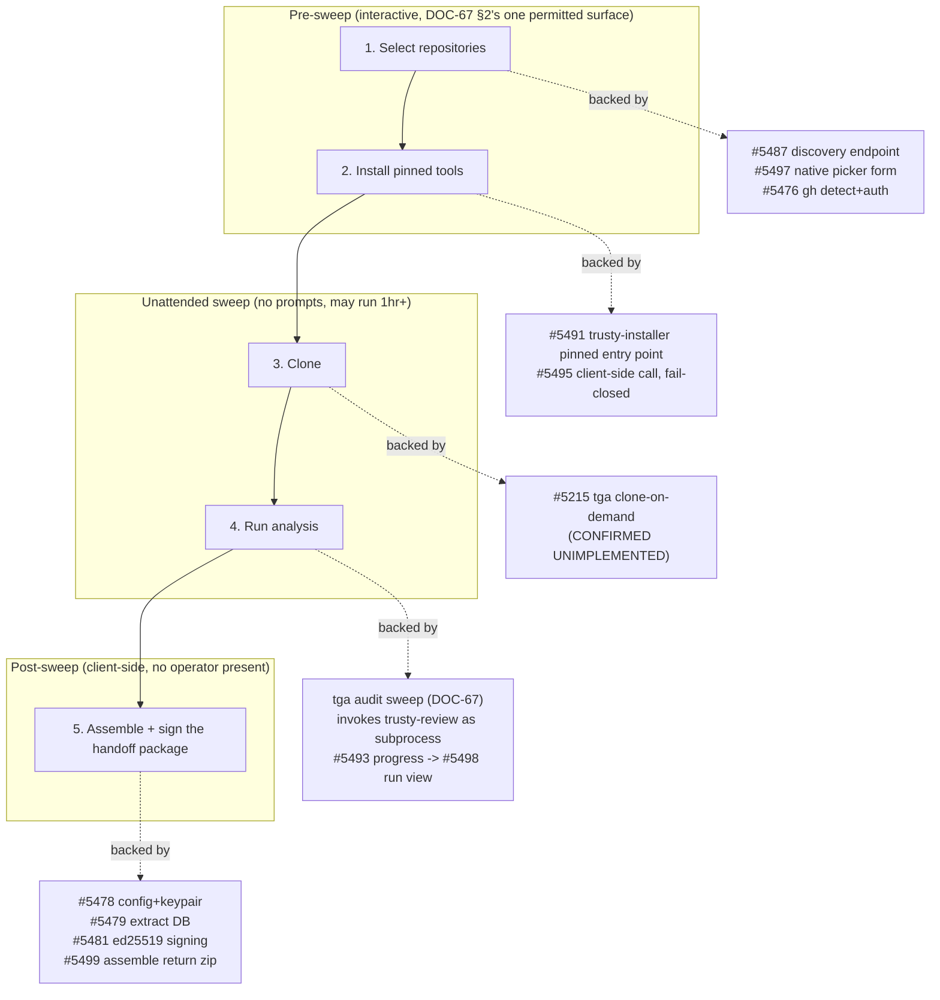
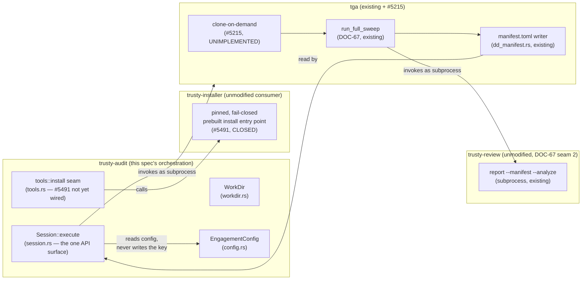

# DOC-68 — The Audit Engagement Handoff Package: Select, Clone, Analyze, Sign

**Status:** Draft — awaiting owner review of §14's open questions and §15's
named gaps. Nothing below is implementation-ready until those are resolved;
this document describes the sequence as the current issue tree commits to it,
not a design proposal competing with that tree.
**Spec ID:** `SPEC-AUDITPKG-01~draft` … `SPEC-AUDITPKG-15~draft`
**Subsystem:** `trusty-audit` — the auditor client (orchestration, working
directory, engagement config, tool seam); `trusty-git-analytics` (tga) — clone
acquisition, the audit sweep, manifest emission; `trusty-installer` — pinned
binary download and verification; `trusty-review` — report rendering, invoked
unmodified as a subprocess
**Owner:** Bob Matsuoka
**Last-updated:** 2026-08-11
**DOC-N claim:** `DOC-68`, scan-before-claim per DOC-38 §4.1. Verified against
this worktree (branched from `origin/main` at `aadbbd5bb`):
`scripts/check_doc_numbers.sh` reports 116 docs / 110 claims, 3 grandfathered,
0 violations before this file was added; `docs/specs/README.md`'s own catalog
note (updated 2026-08-08) names `DOC-68` as the next free number after
DOC-67; a `grep` for a `DOC-68`/`DOC-69` self-label anywhere under
`docs/specs/**` found none; a `gh pr list --search` for both across open PRs
in `bobmatnyc/trusty-tools` returned no match.
**Builds on:** [DOC-67 — tga AUDIT Mode](./DOC-67-tga-audit-mode.md). This is
a **new spec, not an amendment** to DOC-67 — the same treatment DOC-67 §4
itself gives repo acquisition (#5215), zero-config init (#5216), and DB
inspection (#5218): adjacent concerns get their own spec that references
DOC-67, rather than DOC-67's 13 sections growing to cover them. DOC-67 governs
"run the sweep and render a report" (the `tga audit` command and its
trusty-review/trusty-analyze seams); this spec governs the handoff package
that *invokes* that sweep as one step among five, on hardware DOC-67 never
assumed — the recipient's own machine, with no `tga` operator present.
**Related issues:** epic [#5473](https://github.com/bobmatnyc/trusty-tools/issues/5473)
(handoff package: installer, repo selection, signing, extract delivery) and
epic [#5477](https://github.com/bobmatnyc/trusty-tools/issues/5477) (the
auditor client itself — standalone Tauri app); this spec's own issue
[#5474](https://github.com/bobmatnyc/trusty-tools/issues/5474); children
[#5215](https://github.com/bobmatnyc/trusty-tools/issues/5215) (clone
acquisition), [#5476](https://github.com/bobmatnyc/trusty-tools/issues/5476)
(`gh` detect/install/auth), [#5478](https://github.com/bobmatnyc/trusty-tools/issues/5478)
(engagement config generator), [#5479](https://github.com/bobmatnyc/trusty-tools/issues/5479)
(extract-database delivery), [#5480](https://github.com/bobmatnyc/trusty-tools/issues/5480)
(package-size measurement), [#5481](https://github.com/bobmatnyc/trusty-tools/issues/5481)
(content signing), [#5483](https://github.com/bobmatnyc/trusty-tools/issues/5483)
(outbound zip contents), [#5484](https://github.com/bobmatnyc/trusty-tools/issues/5484)
(Developer-ID signing + notarization of the client `.app`),
[#5487](https://github.com/bobmatnyc/trusty-tools/issues/5487) (repo-discovery
endpoint), [#5491](https://github.com/bobmatnyc/trusty-tools/issues/5491)
(`trusty-installer` pinned entry point — CLOSED),
[#5493](https://github.com/bobmatnyc/trusty-tools/issues/5493) (tga sweep
progress reporting), [#5494](https://github.com/bobmatnyc/trusty-tools/issues/5494)
(working-directory state persistence + resume),
[#5495](https://github.com/bobmatnyc/trusty-tools/issues/5495) (client
downloads + verifies pinned tools), [#5497](https://github.com/bobmatnyc/trusty-tools/issues/5497)
(pre-sweep repo picker), [#5498](https://github.com/bobmatnyc/trusty-tools/issues/5498)
(run view — live progress), [#5499](https://github.com/bobmatnyc/trusty-tools/issues/5499)
(assemble + return the zip), [#5502](https://github.com/bobmatnyc/trusty-tools/issues/5502)
(`trusty-audit` crate scaffold — CLOSED, the code this spec describes).

---

## {#SPEC-AUDITPKG-01~draft} 1. Purpose

An acquirer's diligence team, or any client company commissioning a codebase
audit, receives a package rather than a service call. They run it against
their own repositories, on their own hardware, using their own GitHub
credential, and send a signed result back. `trusty-audit` — the auditor
client — is the program that carries out that sequence:

> **select repositories → clone them → run analysis → produce a signed
> handoff package.**

This spec describes that sequence end to end: what each step does, which
crate owns it, what happens when a step fails partway, and what the recipient
receives and can verify. It is the spec for the *handoff*, not for the audit
sweep itself — DOC-67 already specifies what happens once `tga audit` starts.
This spec's job is everything around that: getting a repository set chosen,
getting the tooling onto a machine that has never run any of it, and turning
the sweep's output into something that travels back across a network
boundary with a defensible claim about what it is.

## {#SPEC-AUDITPKG-02~draft} 2. Relationship to DOC-67 and to the crate's own README

Two documents already say part of this. DOC-67 §5–§9 specify the sweep itself
— the tga→trusty-review adapter, the report's sections, and the
continue-on-failure policy for a mid-sweep acquisition failure. The
`trusty-audit` crate's own README (`crates/trusty-audit/README.md`) documents
the working-directory layout, the credential-asymmetry invariant, and the
CLI-testability constraint as implemented today. This spec does not restate
either. What it adds is the sequence connecting them — the five steps below —
and the decisions and open questions that sit in the seams between DOC-67's
sweep, the crate's scaffold, and the still-open children of epic #5473/#5477.

**A superseded decision this spec must correct, not repeat.** Issue #5474
(which requested this spec) still carries an earlier, resolved-at-filing-time
description of the repo-selection surface: "a local web UI served by the
bundled binary," reached because a plain `file://` page cannot hold a GitHub
credential or call the API past CORS. That description is **stale**. Epic
#5477 supersedes it: *"Shape, final: a standalone Tauri app, not an HTTP
server."* The underlying constraint the earlier design solved — a static page
cannot hold a credential, so the Rust binary must — still holds and still
decides the architecture (§6); only the *mechanism* changed, from
"binary serves a page, browser renders it" to "binary IS the app, its own
window renders the picker." The existing `crates/trusty-audit` code already
reflects the current decision: it is a library with a CLI over it today,
README states plainly that "the desktop shell is a later milestone" and will
be Tauri, never a served localhost page. §6 describes the current design;
this paragraph exists so a reader who found #5474's text first is not misled
by it.

## {#SPEC-AUDITPKG-03~draft} 3. The End-to-End Sequence

Steps 1–2 are the only interactive surface, per DOC-67 §2 extended to this
client (§7): the recipient authenticates `gh`, and picks repositories, before
anything unattended starts. Steps 3–4 are the sweep itself — DOC-67's
one-shot, zero-prompt contract, now running on the recipient's machine
instead of the owner's. Step 5 has no operator decision point at all; it
either produces a package or names what it could not produce (§10, §11).

## {#SPEC-AUDITPKG-04~draft} 4. Scope

**In scope for this spec:**
- The five-step sequence above, at the level of which crate owns each step
  and what crosses each seam (§6–§10).
- The permanent constraints every step must preserve: CLI-testability (§11),
  fail-closed tool installation (§7), and the credential/data-handling
  posture already enforced by `trusty-audit`'s types (§13).
- Naming, not designing, five questions the current issue tree leaves
  unanswered (§14) and the gaps in that tree the sequence surfaces (§15).

**Out of scope, deferred to the children issues that already own it — not
restated here:**
- The audit sweep's internal behavior (stage sequencing, security/architecture
  dimension scope, the report template) — DOC-67, unchanged.
- The exact engagement-config TOML schema (`key_env`, audit-window field,
  signing keypair) — #5478's to design; §10 only names what must be present.
- The exact extract-database size and the return-channel decision it is
  coupled to — #5479/#5480, an explicitly open coupling in epic #5473, not
  resolved here (§15).
- Developer-ID signing and notarization of the client `.app` — #5484, a
  Gatekeeper concern, orthogonal to the content-signing this spec describes
  in §10 (the two are different signing steps; conflating them is the error
  #5481 and #5484 both warn against).
- Checkpoint/resume mechanics for a client left running for an hour-plus —
  #5494's to design; §9 only states that the sweep may run that long and
  that a failure must not be a dead end.

## {#SPEC-AUDITPKG-05~draft} 5. Architecture — Crate Boundaries, No Second Implementation

Four existing or in-flight systems, four seams:

**Seam 1 — `trusty-audit` owns orchestration and the working directory, not
downloading or cloning.** `tools.rs`'s `install` function is a deliberate seam:
it returns `AuditError::NotImplemented { issue: 5491, .. }` today rather than
containing a bespoke download implementation, per CLAUDE.md's common-entry-point
rule (`crates/trusty-audit/src/tools.rs:109-132`). The same rule governs
discovery and clone credentials (§8's open question) — `trusty-audit` must not
grow a second GitHub-API client or a second `gh` invocation site if one
already exists or is already being consolidated (#5475).

**Seam 2 — `trusty-installer` owns pinned, fail-closed binary installation.**
#5491 (closed) added the entry point; #5495 is the client-side call. Nothing
in this spec proposes a second installer.

**Seam 3 — tga owns clone, sweep, and manifest emission**, exactly as DOC-67
specifies, with one new prerequisite this spec's sequence exposes plainly:
clone-on-demand (#5215) is **confirmed unimplemented** — "zero
`Repository::clone` production hits" — which means step 3 of this spec's
sequence has no code today. This spec does not design #5215; it names the
sequence step that depends on it (§8).

**Seam 4 — trusty-review renders, invoked as a subprocess**, unchanged from
DOC-67 §5's "process-boundary precedent" (`SubprocessAnalyzeClient` /
`trusty-review report --manifest <path> --analyze`). tga resolves
`trusty-review` from PATH (or `TRUSTY_REVIEW_BIN`), not a Cargo dependency
edge — `crates/trusty-git-analytics/Cargo.toml:55-57` records why: two
binaries with independent release cadences, coupled by an invocable
subprocess contract instead of a compile-time edge, is the TOML manifest
itself standing in for the seam. This client's step 4 (§9) invokes the same
`tga audit` command DOC-67 specifies; it adds no second path into
trusty-review.

## {#SPEC-AUDITPKG-06~draft} 6. Step 1 — Repository Selection

**Owner:** `trusty-audit`'s Tauri shell (a later milestone; the CLI drives
the same `Session::execute(Command::Repos)` call today with a stub manifest).

**What must happen, in order, per #5497's closure conditions:** detect `gh` →
install a pinned version if absent/inadequate (#5476) → `gh auth login`
(interactive browser/device-code flow, the recipient's own credential against
their own repos) → discover the repos that credential can reach (#5487) →
render a picker and let the recipient choose (#5497) → **only then** does the
unattended sweep (steps 3–4) begin. DOC-67 §2's one-shot rule extends here
unchanged: "Nothing after the sweep begins may prompt" (#5497, #5476).

**Why a native window, not a served page.** The constraint that forced the
earlier local-web-UI design still holds — a plain `file://` HTML page has no
route to the recipient's GitHub credential and the browser blocks a
cross-origin call to the GitHub API (no token, CORS) — but the *answer*
changed with the shape decision in #5477: the Tauri app's own Rust process
holds the credential and proxies the discovery call through its own IPC
commands into its own webview, never through a served HTTP endpoint a
separate browser process would have to trust. §2 above states this is a
correction to #5474's own filed text, not a new decision.

**What backs the picker and is still open.** #5487 (repo-discovery endpoint)
is unresolved on one axis its own closure conditions leave explicit: discover
via the GitHub API directly, or shell out to `gh repo list` — and that choice
is entangled with #5475 (gh has no common entry point across 5+ existing call
sites in tga). §14 Q4 below states this spec's proposed answer; it is not
settled by any issue today.

**Empty or partial selection.** No issue states a minimum or maximum repo
count, or what happens when the recipient selects zero repos. §14 Q3
proposes an answer.

## {#SPEC-AUDITPKG-07~draft} 7. Step 2 — Tool Installation, Fail-Closed on Verification

**Owner:** `trusty-audit`, calling `trusty-installer`'s pinned entry point —
never a second download path (§5 Seam 2).

**The binding constraint, restated from the issue tree, not re-decided:**
`tga`, `trusty-analyze`, and `trusty-review` install as one pinned set — all
three or none. #5495's closure conditions require the client to fail closed
on any mismatch between the pinned version recorded in the engagement config
and what was actually downloaded, "never a silent degrade." This is the same
version-skew defect class #5454/PR #5458 closed on the sweep side (a newer
`tga` paired with an older `trusty-review` silently producing a report and
exiting 0) — #5495 exists specifically so the *installer* cannot reopen it
from the download side. `tools::status` (`crates/trusty-audit/src/tools.rs:95-107`)
today checks only file presence, "verifying a binary's version or checksum is
#5491's job, not a second implementation here" — the version-pin check itself
is not yet implemented; this spec records that the requirement is
**fail-closed, all-or-none**, not that the code exists.

**Consequence for the guided flow.** `Session::guided()`
(`crates/trusty-audit/src/session.rs:197-227`) already orders "select
repositories, then install tools" — `NextStep::SelectRepositories` outranks
`NextStep::InstallTools` when both are missing (§6's ordering, encoded in the
type today, not merely documented).

## {#SPEC-AUDITPKG-08~draft} 8. Step 3 — Clone

**Owner:** tga, via #5215's clone-on-demand — **confirmed unimplemented**
today (§5 Seam 3). Every entry in tga's `Config.repositories[]` must already
be a checkout on disk before any existing tga command runs
(`crates/trusty-git-analytics/src/core/config/mod.rs:325-340`); this client's
step 3 is the thing that is supposed to make that true for a recipient who
has never run `git clone` against any of their own repositories.

**Credential.** Step 1 already resolved `gh auth login` against the
recipient's own account (#5476). Whether cloning reuses that same credential
(via `gh`'s git-credential helper) or requires a second, separate
authentication step is not decided by any issue in the current tree — #5215's
scope list names "clone auth (distinct from API auth)" as something to
decide, without deciding it. §14 Q4's proposed answer covers this alongside
discovery.

**Partial failure.** No issue states what happens when one repo among several
fails to clone — does the sequence abort, skip that repo and continue, or
something else? §14 Q2 proposes an answer, extending DOC-67 §9's
continue-on-failure policy (already established for the *analysis* stage) to
this earlier, currently undesigned stage.

## {#SPEC-AUDITPKG-09~draft} 9. Step 4 — Run Analysis

**Owner:** tga's existing `run_full_sweep` (DOC-67, unchanged), invoked by
this client exactly as DOC-67 §6 specifies — one `manifest.toml`, one
subprocess call into `trusty-review report --manifest <path> --analyze`. This
spec adds nothing new to the sweep's internals; it names what the client
around it must do while the sweep runs.

**Progress, not silence, for up to an hour-plus.** #5498's closure conditions
require the run view to show live per-repo clone progress (once #5215 lands)
and live per-phase/per-repo audit progress, via #5493's typed `ProgressBus`
events — today only the Collect stage emits repo-level events; the other
seven stage functions `run_full_sweep` calls "take no `ProgressBus` parameter
at all," per #5493's own citations. A failed repo or stage must render as
**failed-but-continuing**, never as a dead-ended run (#5498, extending DOC-67
§9's acquisition-failure policy to the client's own display of it).

**Must stay open, no resume in v1.** #5498 and #5494 both record the owner's
choice — "document it, restart on failure" — over checkpoint/resume; the
client window stays open for the sweep's whole duration with no detached
background process. #5494 tracks saving run-state (which repos/phases
completed) so a *restart* is not a full re-run, but that is a v1
in-scope amendment, not a resume path for a still-running client.

## {#SPEC-AUDITPKG-10~draft} 10. Step 5 — Assemble and Sign the Handoff Package

**Owner:** `trusty-audit`, once the sweep (step 4) completes.

**What goes into the return package**, per the closure conditions of #5478,
#5479, #5481, and #5499 together:
- The rendered report and its JSON twin (DOC-67 §8's output).
- The tga extract database (#5479) — metadata only, verified against all 23
  migrations under `crates/trusty-git-analytics/src/core/db/sql/`: no
  diff/patch/hunk/blob column exists anywhere in the schema. The precise
  claim any package documentation must use is **"no file content, diffs,
  patches, hunks, or blobs"** — never "no code" — because free-text columns
  (`commits.message`, `pull_requests.title`, `work_items.title`,
  `work_items.raw_json`, `classification_overrides.notes`) can carry a
  human-pasted snippet. This matches DOC-67 §10's own finding; #5479 restates
  it as a closure condition rather than a coincidence.
- The engagement config's metadata (client/engagement labels, the versions
  that produced this run — #5478, #5495's "the report package records which
  versions produced it").
- **Never** the OpenRouter key. `SecretKey` (`crates/trusty-audit/src/config.rs:35-71`)
  has no `Serialize` impl by construction — writing it into any output
  artifact is a compile error, not a runtime check. This is the one invariant
  the crate's module docs call load-bearing across the whole handoff:
  *"A credential belongs in the file that goes to the recipient, never in
  the file that comes back."*

**What "signed" means, and what the recipient/we verify it with (#5481).** A
fresh ed25519 keypair is generated per engagement by #5478's config
generator. The **private half travels IN the outbound package**, so the
recipient signs locally with no service call back to us. What gets signed is
not the files directly but a **manifest listing each delivered file's
SHA-256** — reducing "sign a multi-file bundle" to "sign one small manifest."
The **public half is retained by us, out of band**, for verification: on
receipt, we recompute each file's SHA-256, confirm it matches the signed
manifest, and check the manifest's signature against our retained public key.

**The limit this spec must state plainly, not soften.** This is
**tamper-evidence, not proof against the recipient** — a signature made on
hardware the recipient fully controls can be forged by that recipient. It
defends against tampering in transit or by an unrelated third party; it does
not defend against a dishonest recipient re-signing an altered bundle with
their own copy of the same private key. #5481 records that alternatives
(submission to an endpoint we control; us re-running the audit ourselves)
were offered and explicitly declined — this is the accepted trust model, not
an interim one awaiting a stronger mechanism.

**Boundary with #5484.** Developer-ID signing and notarization (#5484) is a
**different signing step**, solving a different problem: it satisfies
macOS Gatekeeper on the client `.app` itself so double-clicking it doesn't
produce "cannot be opened because the developer cannot be verified." It
authenticates *who built the binary*; #5481's ed25519 signature authenticates
*what the delivered content is*. Conflating the two — treating a notarized
binary as if it also vouches for the report's integrity, or vice versa — is
the exact error both issues warn against.

## {#SPEC-AUDITPKG-11~draft} 11. CLI-Testability — the Permanent Constraint

Every step above is, by construction, reachable with no window. This is not
aspirational — it is enforced by the type system today, and this spec
requires every later milestone to preserve it:

- `session::Command` is the capability set (`crates/trusty-audit/src/session.rs:39-50`).
- `Session::execute` is the only way to run one (`session.rs:173-181`) — no
  method on `Session` is reachable except through it.
- `cli.rs` matches exhaustively over `Command` (`crates/trusty-audit/src/cli.rs:78-86`),
  so a capability variant with no CLI arm fails to compile — the test
  `cli_tests::every_command_variant_has_a_cli_invocation` (`cli.rs:224-235`)
  exercises exactly this.

Owner's words on #5502, restated because they bind every future milestone in
this sequence, not just the scaffold that already shipped: *"in fact you
should be able to test all features via cli."* Every future `Command` variant
this spec's five steps eventually need — repo picking, tool install, clone
progress, sweep progress, package assembly, signing — lands as a `Command`
variant with a CLI arm in the same PR that adds it. The Tauri shell, when it
arrives, is a view over `Session::execute`, never a second place a capability
can live.

## {#SPEC-AUDITPKG-12~draft} 12. Recomputability Boundary — What the Extract Database Actually Lets a Reader Recompute

Shipping the extract database (§10, #5479) invites an unstated assumption —
that a reader can rerun the numbers and get the same report back. That claim
is **false for part of the report**, and this spec states the boundary
precisely rather than letting the package imply more than it delivers.

**Recomputable from the extract database** (per epic #5473's own accounting):
Report Metadata, DOC-67 §3's Scoring Model Normalization, §4's
Per-Application Scorecard and Health-Factor scores, §5's Findings by
Severity, §6.1's Security Violations, §7's Graph-Ready Appendix, §8's Gaps &
Caveats.

**Not recomputable, on the record rather than silently omitted:** DOC-67
§8's Executive Summary and Top Risks (§2 of the rendered report). #5454/PR
#5458 made LLM inference mandatory there — that section is LLM-authored
prose that will not reproduce identically on a second run, even at
temperature 0, because it passes through a network call to a model. The
*facts underlying* §2 stay checkable against the recomputable sections above;
the prose itself does not reproduce.

**No child issue may claim whole-report reproducibility.** This is an
explicit correction epic #5473 already states about its own children's
scope, restated here because the handoff package (this spec's subject) is
exactly the artifact a client would use to make that claim, correctly or not.

## {#SPEC-AUDITPKG-13~draft} 13. Credential and Data-Handling Posture

**No provisioning API.** Owner, verbatim (epic #5473): *"I don't want to use
provisioning keys, I want to provide a key per use."* The owner mints a
spend-capped OpenRouter key per engagement out of band; nothing in this
sequence mints a key or holds an operator credential. `EngagementConfig`
(`crates/trusty-audit/src/config.rs:82-95`) is the config's schema as read
today — plain TOML, unencrypted by design, consistent with the transparency
premise the whole handoff rests on (the recipient can read what the tool will
do before running it, and inspect what leaves their network before sending
it — same posture on both ends).

**The recipient's GitHub credential** (`gh auth login`, §6, §8) is a
separate credential from the OpenRouter key and is never written to the
engagement config or the return package — it lives only in `gh`'s own local
credential store on the recipient's machine.

**What the working directory holds is a data-handling surface, not just a
cache.** `repos/` is the recipient's own source code; `extract/` is derived
from it. The README's `rm -rf <work-dir>` deletion guarantee
(`crates/trusty-audit/README.md:58-61`, backed by the tested property
`workdir::layout_tests::every_layout_path_is_inside_the_root`) is what makes
that posture inspectable and reversible, not merely asserted.

## {#SPEC-AUDITPKG-14~draft} 14. Open Questions for the Owner

Five questions the current issue tree leaves genuinely unanswered. Each is
marked **proposed-pending-owner-approval** — none of these is a decision this
spec is entitled to make silently.

**Q1 — Can an e2e test of this sequence use fixture repositories, or does it
require real GitHub repos?**

Nothing in #5215's closure conditions forbids a fixture remote; the
conditions ("tga can take an org/workspace + a repo name it has never seen
and produce a local checkout") describe production behavior, not a test
harness's inputs. **Proposed:** yes, fixture repositories — bare local git
repos as clone sources for the clone-and-analyze legs, plus a fake/recorded
discovery source behind a trait seam for the picker leg — should cover the
sequence in CI, consistent with §11's CLI-testability constraint (a test that
needs a live GitHub credential is not runnable in CI with no window and no
network egress either). A single opt-in, `--include-ignored`-gated test
against a real throwaway GitHub org is reasonable as an additional release
gate, not as the only coverage. **Not decided by any issue today** — no
child of #5473/#5477 tickets an e2e test harness at all (§15).

**Q2 — How do partial failures surface: one repo of five fails to clone, or
analysis fails on one repo? Does the run abort, continue, or produce a
partial package?**

DOC-67 §9 already answers this for the *analysis* stage: continue, name the
excluded repo in Gaps & Caveats, never abort the other repos for one
transient failure — "a one-shot, unattended, potentially hundred-repo org
sweep cannot abort the entire run because one repo among many had a transient
fetch failure." **Proposed:** extend the identical policy to the *clone*
stage (§8), which DOC-67 never covered because clone-on-demand didn't exist
when DOC-67 was written. `AuditManifest.report.gaps: Vec<String>`
(`crates/trusty-audit/src/manifest.rs:56-58`) already has a field built to
carry exactly this kind of named exclusion — a failed-repo clone should
populate it the same way an analysis gap does. The package that step 5
assembles is then always the best-effort result of whichever repos succeeded,
never a hard abort, unless every repo fails or the recipient selected zero
repos (Q3). **Not decided by any issue** — #5215's scope list names "partial
clone failure" as something to handle without saying whether the *sequence*
(as opposed to the individual clone operation) continues past it.

**Q3 — Is repository selection cross-org? Is there a minimum or maximum
count? What happens when the selected set is empty?**

#5487's own closure conditions settle cross-org: discovery "Returns the set
of repos the configured credential can access, not limited to a single named
org" and "covers personal repos and org repos the token can see." **Proposed
for count:** no hard minimum or maximum in v1 — a single-repo audit is a
legitimate engagement and nothing in the issue tree tickets an upper bound.
**Proposed for empty selection:** the picker form (#5497) should disable
whatever action starts the sweep until at least one repo is selected, the
same way `Session::guided()`'s `NextStep::SelectRepositories`
(`crates/trusty-audit/src/session.rs:204-219`) already gates on "no manifest
or an empty repository list" before offering to move on to tool installation
— client-side validation, not a runtime error path. **Not decided by any
issue** — no child states a minimum/maximum or an empty-selection behavior
explicitly.

**Q4 — What credential does discovery and cloning use? Does discovery go
through the GitHub API or shell out to `gh repo list`?**

#5476 resolves the auth-flow half: the client detects-or-downloads `gh` and
runs `gh auth login` pre-sweep. #5487 leaves the discovery-mechanism half
explicitly open, entangled with #5475 (gh has no common entry point across
5+ existing tga call sites). **Proposed:** route both discovery and clone
through `gh` — `gh repo list --json ...` (or `gh api`) for discovery, and
`gh`'s git-credential helper for the actual clone — rather than building a
second, independent GitHub API HTTP client inside `trusty-audit` or `tga`.
Reasoning: #5476 already commits to `gh` as the on-machine credential holder
for this exact flow, and a second credential surface (a raw API token
resolved and held separately from `gh`'s own store) duplicates a capability
`gh` already owns — the same class of defect CLAUDE.md's common-entry-point
rule names for `Command::new`/HTTP-client construction generally. This
proposal is contingent on #5475 landing first or alongside: adding a sixth
`gh` call site to a tool with no common entry point across its existing five
compounds the defect #5475 already tracks rather than fixing it. **Not
decided by any issue** — #5487 states the fork exists and does not resolve
it; #5475 is filed but unscoped to this decision.

**Q5 — What makes the handoff package "signed," and what does the recipient
verify it with?**

This is answered by #5481, not genuinely open — restated here because #5474's
own closure conditions ask for it explicitly. See §10: an ed25519 signature
over a SHA-256 manifest of delivered files, signed locally by the recipient
using a private key that travelled in the outbound package, verified by us
against a public key we retain out of band. **The one open sub-question
#5481 does not settle:** where and how "we" perform that verification — no
issue names a tool, command, or location for the verification step itself
(only that it happens on "our side"). **Proposed:** a `trusty-audit`
(or `tctl`) subcommand that takes a received package and the retained public
key and reports pass/fail — consistent with §11's CLI-testability
constraint, since this is exactly the kind of capability that must not exist
only as something "run by hand" on the owner's machine. **Not decided by any
issue** — named as a gap in §15 as well, since no child issue currently owns
building it.

## {#SPEC-AUDITPKG-15~draft} 15. Gaps in the Issue Tree — Named, Not Designed

Per this spec's own brief: a step the sequence needs but no issue currently
tickets is named here as a gap, not designed as if it were already scoped.

- **No issue owns the verification-side tooling** for #5481's signature
  scheme (Q5 above). #5481's closure conditions require "verification tooling
  on our side" to exist, but no child issue builds it.
- **No issue tickets an end-to-end test harness** for this five-step
  sequence as a whole (Q1 above). Individual steps have their own unit tests
  once built; nothing currently owns proving the *sequence* — select, clone,
  analyze, sign — works together against a fixture engagement.
- **The return channel is explicitly unresolved**, and epic #5473 already
  says so rather than this spec discovering it: "the return channel for the
  finished package (email attachment, an upload endpoint we don't have, or
  something else) is unspecified — coupled to #5479's package-size question,
  since a 25–115 MB bundle may rule out email." This spec's step 5 (§10) ends
  at "the client surfaces the finished zip's location... for the recipient to
  send back" (#5499) — what "send back" means mechanically is the named gap.
- **#5475 (gh common entry point) is a soft prerequisite this spec's Q4
  proposal depends on**, not a hard blocker recorded anywhere in the #5473/
  #5477 tree as gating Q4's resolution. Flagged so the dependency is visible
  before code lands, not discovered mid-implementation.
- **Clone-credential distinctness** — #5215's own scope list names "clone
  auth (distinct from API auth)" as something to decide, and this spec's Q4
  proposes folding it into `gh`'s credential, but no issue has accepted or
  rejected that specific fold.

---

*This document is the deliverable requested by
[#5474](https://github.com/bobmatnyc/trusty-tools/issues/5474). No code was
written and no issue was filed. §14's five questions and §15's gaps are
presented for owner review; nothing in this spec should be read as resolving
them.*
