# Technical Due-Diligence Analysis: Technical Due Diligence

> Provenance: ⁽ᵐ⁾ measured (computed from the repository) · ⁽ᵈ⁾ declared (manifest / metrics input) · ⁽ⁱ⁾ inferred (LLM, evidence-grounded). Genuinely unknowable fields are omitted and listed under Gaps & Caveats.

## 1. Report Metadata

| Field | Value |
|---|---|
| Source document | repository inspection (manifest: /Users/masa/dogfood-audit-tt2/out/00-local-trusty-tools/manifest.toml) |
| Vendor / methodology | trusty-review report (repository inspection) v0.22.0 ⁽ᵐ⁾ |
| Report date / version | 2026-08-21 ⁽ᵐ⁾ |
| Target / deal codename | Technical Due Diligence |
| Applications / systems assessed | 00-local-trusty-tools ⁽ᵈ⁾ |
| Analysis generated | 2026-08-21 ⁽ᵐ⁾ |

## Key Facts

| Metric | Value |
|---|---|
| Codebase size (total LoC) | 1553771 ⁽ᵐ⁾ |
| File count | 6664 ⁽ᵐ⁾ |
| Primary languages | Rust, HTML, Shell, Svelte, TypeScript ⁽ᵐ⁾ |
| Complexity profile | Not computed — this run carried no trusty-analyze metrics; re-run with `--analyze` |
| Number of authors | 5 ⁽ᵐ⁾ |
| Estimated work volume | Not computed — no upstream effort-estimation metric exists |
| 12-month trajectory | increasing over the trailing 4 month(s): avg 7213.5 commit(s)/mo across avg 3.8 active author(s)/mo ⁽ᵐ⁾ |

## 2. Executive Summary

00-local-trusty-tools is a large, Rust-centric developer tooling suite (~1.55M LoC, with HTML, Shell, and Svelte components) built via Cargo and organized into numerous crates. Its major components, drawn from the assessed code, span ticketing/MCP integration (trusty-common tickets server, with JIRA and Google Workspace backends), agent orchestration and a Svelte UI (trusty-agents, trusty-code, trusty-mpm managing Claude Code sessions), search and indexing (trusty-search, BM25 and HNSW vector/symbol-graph stores in trusty-common/memory_core), a memory subsystem (trusty-memory), git analytics collection (trusty-git-analytics, with Bitbucket support), an embedder daemon (trusty-embedderd), and a curl|sh bootstrap installer. The system is installed locally and integrates with external SaaS (JIRA, Google Workspace, Anthropic) via stored credentials.

From an acquirer's standpoint, the risk profile is dominated by credential-handling and secrets hygiene despite no single finding rising to RED severity. Multiple AMBER findings show secrets persisted in plaintext or unencrypted on disk (OAuth client secret and minted access/refresh tokens in ~/.gworkspace-mcp, JIRA Basic-auth tokens base64-encoded and retained in memory, API bearer tokens in browser-side stores), credentials at risk of leaking through unredacted error strings, and unsafe operational defaults (Claude sessions always launched with --dangerously-skip-permissions, curl|sh installing an unsigned script, health/config endpoints exempt from auth). A JQL injection risk via unescaped string interpolation compounds the exposure. Alongside these sit systemic scalability constraints rooted in single-process, in-memory-only state and a cluster of silent-failure patterns that mask data loss and misconfiguration. Layered on top is acute key-person risk (bus factor 1, 87% single-author concentration).

Coverage is a material caveat: only 1.1% of files were inspected, so the 102 verified findings should be read as a floor, not a ceiling. No dimension was marked not-investigated and no batch failed, but the sampling depth alone warrants deeper follow-up before close. ⁽ⁱ⁾

**Contents**

- [1. Report Metadata](#1-report-metadata)
- [Key Facts](#key-facts)
- [3. Scoring Model Normalization](#3-scoring-model-normalization)
- [4. Per-Application Scorecard](#4-per-application-scorecard)
- [5. Findings by Severity](#5-findings-by-severity)
- [Code Quality & Architecture](#code-quality--architecture)
- [Security Posture](#security-posture)
- [Performance & Scalability](#performance--scalability)
- [6. Risk Registers](#6-risk-registers)
- [7. Graph-Ready Data Appendix](#7-graph-ready-data-appendix)
- [8. Ticketing & Delivery Traceability](#8-ticketing--delivery-traceability)
- [9. Gaps & Caveats](#9-gaps--caveats)
- [Synthesis Status](#synthesis-status)
- [Dependency Inventory](#dependency-inventory)
- [Investigation Coverage](#investigation-coverage)

### Top Risks

| # | Risk | Severity | Est. cost/effort | Affected application(s) |
|---|---|---|---|---|
| 1 | Secrets are pervasively mishandled: OAuth client secrets and tokens stored unencrypted on disk, JIRA tokens base64-encoded and retained in memory, API bearer tokens in browser stores, and credentials at risk of leaking through unredacted error strings. ⁽ⁱ⁾ | AMBER | High — encryption-at-rest, redaction, and credential-store redesign across multiple crates ⁽ⁱ⁾ | 00-local-trusty-tools |
| 2 | JQL queries are built by direct string interpolation of user-controlled query, assignee, and label values, permitting quote-breaking injection into the JIRA backend. ⁽ⁱ⁾ | AMBER | Medium — input escaping/parameterization and validation hardening ⁽ⁱ⁾ | 00-local-trusty-tools |
| 3 | Unsafe operational defaults: Claude sessions always launch with --dangerously-skip-permissions, the installer uses an unsigned curl|sh pattern, and health/config endpoints are exempt from authentication. ⁽ⁱ⁾ | AMBER | Medium — policy change plus installer signing infrastructure ⁽ⁱ⁾ | 00-local-trusty-tools |
| 4 | Systemic single-process, in-memory-only architecture: per-process concurrency limiters, non-Sync Database forcing sequential persistence, sessions and task history without durability, full-table analytics scans, and hard-coded caps that silently drop documents and symbols under load. ⁽ⁱ⁾ | AMBER | High — persistence layer and horizontal-scaling redesign ⁽ⁱ⁾ | 00-local-trusty-tools |
| 5 | Acute key-person risk with bus factor 1 and 87% of touches from a single author, spanning single-author deploy, docker, test, and packaging subsystems. ⁽ⁱ⁾ | AMBER | Medium — knowledge transfer and contributor onboarding ⁽ⁱ⁾ | 00-local-trusty-tools |

## 3. Scoring Model Normalization

Captures the SOURCE report's native scale so a reader can compare this
report against others normalized through this same template.

| Field | Value |
|---|---|
| Native scale | trusty-review normalized 0–100 quality scale (higher is healthier) ⁽ᵐ⁾ |
| Native band definitions | RED < 33 (critical); AMBER 33–66 (medium risk); GREEN > 66 (healthy) ⁽ᵐ⁾ |
| Normalized mapping (0-100) | already 0–100; RED/AMBER/GREEN bands applied directly ⁽ᵐ⁾ |
| RED threshold (normalized) | < 33 ⁽ᵐ⁾ |
| AMBER threshold (normalized) | 33–66 ⁽ᵐ⁾ |
| GREEN threshold (normalized) | > 66 ⁽ᵐ⁾ |
| Aggregation method (app-level from module/rule level) | severity bands from repository inspection; application posture aggregates its findings ⁽ᵐ⁾ |
| Peer-benchmark population (if any) | cross-repo corpus placement when --benchmark is enabled; otherwise not computed ⁽ᵐ⁾ |

## 4. Per-Application Scorecard

### 4.1. 00-local-trusty-tools

**Profile**

| Field | Value |
|---|---|
| Technology stack | Rust 1,408,871 · HTML 33,376 · Shell 31,635 · Svelte 28,099 ⁽ᵐ⁾ |
| Frameworks / manifests | Cargo.toml: ⁽ᵐ⁾ |
| Technical size (LoC) | 1553771 ⁽ᵐ⁾ |
| Files / classes / DB artifacts | 6664 files ⁽ᵐ⁾ |

**Health-Factor Scores**

_No data available — see Gaps & Caveats._

**Benchmark Position**

_No data available — see Gaps & Caveats._

## 5. Findings by Severity

### 5.1 RED / CRITICAL Findings (full detail)

_No data available — see Gaps & Caveats._

### 5.2 AMBER / MEDIUM Findings (full detail, more compact)

**00-local-trusty-tools:**

1. **Backend errors serialized into JSON payload losing structured error context** — All tool-call failures are collapsed into a generic string error map, discarding error type and JSON-RPC error codes ⁽ⁱ⁾
- **Component:** crates/trusty-common/src/tickets/server.rs:84
- **Remediation:** Map backend errors to structured JSON-RPC error codes rather than a flat string ⁽ⁱ⁾
- **Evidence** (`crates/trusty-common/src/tickets/server.rs:84`) ⁽ᵐ⁾:
```
Err(e) => json!({ "error": e.to_string() }),
```

2. **Process-wide env-var mutation in tests requires global mutex to avoid races** — Backend selection relies on process-global env vars whose mutation forces serialized tests via an explicit mutex to prevent flakes ⁽ⁱ⁾
- **Component:** crates/trusty-agents/src/memory/mod.rs:211
- **Remediation:** Thread configuration through explicit parameters/config structs rather than reading process-global env vars at open time ⁽ⁱ⁾
- **Evidence** (`crates/trusty-agents/src/memory/mod.rs:211`) ⁽ᵐ⁾:
```
static ENV_GUARD: Mutex<()> = Mutex::new(());
```

3. **Unsafe env-var mutation blocks used pervasively across tests** — Tests wrap env-var mutation in unsafe blocks and rely on locks/serial annotations to avoid process-wide interference ⁽ⁱ⁾
- **Component:** crates/trusty-memory/tests/isolation_override.rs:403
- **Remediation:** Prefer dependency injection of the data-dir override rather than reading a process-global env var at daemon startup ⁽ⁱ⁾
- **Evidence** (`crates/trusty-memory/tests/isolation_override.rs:403`) ⁽ᵐ⁾:
```
unsafe { std::env::set_var(trusty_common::DATA_DIR_OVERRIDE_ENV, "/tmp/some-override") };
```

4. **Isolation test skips silently when $HOME cannot be resolved** — A critical isolation guard test returns early instead of failing when the environment prerequisite is missing ⁽ⁱ⁾
- **Component:** crates/trusty-memory/tests/isolation_override.rs:213
- **Remediation:** Fail loudly or use an explicit fixture rather than silently skipping the security-relevant test ⁽ⁱ⁾
- **Evidence** (`crates/trusty-memory/tests/isolation_override.rs:213`) ⁽ᵐ⁾:
```
eprintln!("SKIP: could not resolve $HOME — skipping dotfile isolation test");
            return;
```

5. **tools/list count assertion is a loose lower bound, not an exact contract** — The tools list is validated only by a minimum-count check, not by tool name or schema correctness ⁽ⁱ⁾
- **Component:** crates/trusty-common/src/tickets/server.rs:422
- **Remediation:** Assert the exact set of tool names and validate their schemas ⁽ⁱ⁾
- **Evidence** (`crates/trusty-common/src/tickets/server.rs:422`) ⁽ᵐ⁾:
```
tools.len() >= 30,
            "expected >= 30 tools, got {}",
```

6. **list_teams tool aliased to list_projects as a stub** — The list_teams tool silently returns project data instead of team data, presenting incorrect semantics to callers ⁽ⁱ⁾
- **Component:** crates/trusty-common/src/tickets/server.rs:316
- **Remediation:** Either implement list_teams properly or return an explicit not-implemented error ⁽ⁱ⁾
- **Evidence** (`crates/trusty-common/src/tickets/server.rs:316`) ⁽ᵐ⁾:
```
// Best effort: equivalent to list_projects for now.
            let b = backend_for(state, &args)?;
            to_json(b.list_projects().await?)
```

7. **Legacy migration and layout renames indicate accumulating storage-format debt** — The code carries deprecated env-var names and one-off directory-migration logic for legacy on-disk layouts ⁽ⁱ⁾
- **Component:** crates/trusty-agents/src/memory/mod.rs:67
- **Remediation:** Consolidate on canonical config, add versioned schema/migration handling, and plan deprecation removal ⁽ⁱ⁾
- **Evidence** (`crates/trusty-agents/src/memory/mod.rs:67`) ⁽ᵐ⁾:
```
pub const MEMORY_BACKEND_ENV_DEPRECATED: &str = "OPEN_MPM_MEMORY_BACKEND";
```

8. **JQL query built by string interpolation of user-controlled fields (injection risk)** — Query, assignee, and label values are concatenated directly into JQL strings without escaping, allowing quote-breaking injection ⁽ⁱ⁾
- **Component:** crates/trusty-common/src/tickets/api/backends/jira/backend.rs:151
- **Remediation:** Escape embedded quotes/special characters or use parameterised JQL constructs before interpolation ⁽ⁱ⁾
- **Evidence** (`crates/trusty-common/src/tickets/api/backends/jira/backend.rs:151`) ⁽ᵐ⁾:
```
jql.push_str(&format!(" AND text ~ \"{q}\""));
```

9. **JIRA credentials stored in-memory as a Basic auth header with no redaction guarantee** — The API token is base64-encoded (not encrypted) and retained on the struct, risking exposure if the struct is ever logged or debugged ⁽ⁱ⁾
- **Component:** crates/trusty-common/src/tickets/api/backends/jira/client.rs:36
- **Remediation:** Wrap the token in a redacting secret type and ensure Debug/Display never render it ⁽ⁱ⁾
- **Evidence** (`crates/trusty-common/src/tickets/api/backends/jira/client.rs:36`) ⁽ᵐ⁾:
```
let creds = format!("{email}:{token}");
        let encoded = base64::engine::general_purpose::STANDARD.encode(creds.as_bytes());
        let auth_header = format!("Basic {encoded}");
```

10. **Global concurrency limiter caps in-flight expensive requests within a single process** — The limiter is a per-process semaphore, so horizontal scaling requires external coordination and the default cap of 8 may throttle under load ⁽ⁱ⁾
- **Component:** crates/trusty-search/src/service/concurrency.rs:46
- **Remediation:** Document horizontal-scaling behaviour and consider tuning defaults per host capacity ⁽ⁱ⁾
- **Evidence** (`crates/trusty-search/src/service/concurrency.rs:46`) ⁽ᵐ⁾:
```
const DEFAULT_MAX_CONCURRENT: usize = 8;
```

11. **Queue-timeout is cached in a process-global OnceLock, ignoring later env changes** — The queue timeout is resolved once and cached for the process lifetime, so runtime reconfiguration of TRUSTY_QUEUE_TIMEOUT_SECS has no effect ⁽ⁱ⁾
- **Component:** crates/trusty-search/src/service/concurrency.rs:65
- **Remediation:** Document the boot-time-only nature or read the value per-limiter-construction instead of globally caching ⁽ⁱ⁾
- **Evidence** (`crates/trusty-search/src/service/concurrency.rs:65`) ⁽ᵐ⁾:
```
static CACHED: std::sync::OnceLock<std::time::Duration> = std::sync::OnceLock::new();
    *CACHED.get_or_init(|| {
```

12. **Abandoned OS thread on embedder init timeout** — On timeout the blocking init thread is leaked, which is only safe because the process exits immediately afterward ⁽ⁱ⁾
- **Component:** crates/trusty-embedderd/src/readiness.rs:29
- **Remediation:** Document the single-shot process-exit invariant and guard against reuse in a persistent context ⁽ⁱ⁾
- **Evidence** (`crates/trusty-embedderd/src/readiness.rs:29`) ⁽ᵐ⁾:
```
the still-blocked OS thread inside `spawn_blocking`
//! (`FastEmbedder::with_cache_size` runs the ORT init on a blocking-pool
//! thread) is abandoned, exactly like the existing CoreML-hang bound in
```

13. **JIRA milestone/project field extraction silently defaults missing fields to empty strings** — Absent or malformed API fields collapse to empty strings rather than surfacing an error, masking API contract changes ⁽ⁱ⁾
- **Component:** crates/trusty-common/src/tickets/api/backends/jira/backend.rs:280
- **Remediation:** Return errors for required missing fields instead of substituting empty strings ⁽ⁱ⁾
- **Evidence** (`crates/trusty-common/src/tickets/api/backends/jira/backend.rs:280`) ⁽ᵐ⁾:
```
id: r
                    .get("id")
                    .and_then(|v| v.as_str())
                    .unwrap_or("")
                    .to_string(),
```

14. **Fetch credentials/errors surfaced as raw strings may leak sensitive URLs** — Git fetch failures are captured as free-form error strings that may embed remote URLs containing embedded credentials or tokens ⁽ⁱ⁾
- **Component:** crates/trusty-git-analytics/src/collect/collector.rs:45
- **Remediation:** Sanitize fetch error strings to strip credential components from remote URLs before storing/printing ⁽ⁱ⁾
- **Evidence** (`crates/trusty-git-analytics/src/collect/collector.rs:45`) ⁽ᵐ⁾:
```
/// Human-readable error description.
        error: String,
```

15. **BM25 corpus cap silently drops new documents on large corpora** — Above the 50,000-document default cap, brand-new documents are silently dropped from the lexical index ⁽ⁱ⁾
- **Component:** crates/trusty-common/src/bm25.rs:338
- **Remediation:** Emit per-rebuild dropped-count metrics/telemetry and document the cap prominently for large-corpus deployments ⁽ⁱ⁾
- **Evidence** (`crates/trusty-common/src/bm25.rs:338`) ⁽ᵐ⁾:
```
if self.live_docs >= cap {
                return false;
            }
```

16. **Env-var parsing silently swallows malformed operator config** — A misconfigured TRUSTY_BM25_CORPUS_CAP env var silently falls back to the default with no warning to the operator ⁽ⁱ⁾
- **Component:** crates/trusty-common/src/bm25.rs:44
- **Remediation:** Log a warning when a set env var fails to parse rather than silently defaulting ⁽ⁱ⁾
- **Evidence** (`crates/trusty-common/src/bm25.rs:44`) ⁽ᵐ⁾:
```
std::env::var("TRUSTY_BM25_CORPUS_CAP")
        .ok()
        .and_then(|v| v.parse().ok())
        .filter(|&n: &usize| n > 0)
        .unwrap_or(DEFAULT_BM25_CORPUS_CAP)
```

17. **Collection pipeline processes repositories sequentially** — Each repository is walked one at a time in a serial loop within the run method ⁽ⁱ⁾
- **Component:** crates/trusty-git-analytics/src/collect/collector.rs:329
- **Remediation:** Consider bounded parallelism for per-repo git walks where the git backend allows it ⁽ⁱ⁾
- **Evidence** (`crates/trusty-git-analytics/src/collect/collector.rs:329`) ⁽ᵐ⁾:
```
// #5197: one progress row per configured repository, in walk order.
        for repo_cfg in self.config.repositories.iter() {
```

18. **Database is not Sync forcing sequential persistence** — Persistence is serialized on the main task because the Database type cannot be shared across threads ⁽ⁱ⁾
- **Component:** crates/trusty-git-analytics/src/collect/collector.rs:452
- **Remediation:** Evaluate a connection-pooled or Sync-capable database abstraction to enable parallel writes ⁽ⁱ⁾
- **Evidence** (`crates/trusty-git-analytics/src/collect/collector.rs:452`) ⁽ᵐ⁾:
```
// provider fetches on its own task, then we persist the results
        // sequentially on the main task because `Database` is not `Sync`.
```

19. **BM25 scoring uses partial_cmp with silent NaN fallback** — NaN scores from floating-point BM25 arithmetic are silently treated as Equal in sort ordering ⁽ⁱ⁾
- **Component:** crates/trusty-common/src/bm25.rs:509
- **Remediation:** Guard score computation against NaN inputs or explicitly filter NaN scores before sorting ⁽ⁱ⁾
- **Evidence** (`crates/trusty-common/src/bm25.rs:509`) ⁽ᵐ⁾:
```
b.1.partial_cmp(&a.1)
                .unwrap_or(std::cmp::Ordering::Equal)
```

20. **OAuth client secret persisted in plaintext config file** — OAuth client credentials including the secret are read from an unencrypted on-disk JSON file at `~/.gworkspace-mcp/oauth_client.json` ⁽ⁱ⁾
- **Component:** crates/trusty-gworkspace/src/api/auth/oauth/flow/mod.rs:156
- **Remediation:** Document/enforce restrictive file permissions and consider an OS keychain for the client secret ⁽ⁱ⁾
- **Evidence** (`crates/trusty-gworkspace/src/api/auth/oauth/flow/mod.rs:156`) ⁽ᵐ⁾:
```
GOOGLE_OAUTH_CLIENT_SECRET, or write {} as \
         {{\"client_id\":\"...\",\"client_secret\":\"...\"}}",
```

21. **Minted OAuth access/refresh tokens stored via TokenStorage without evident encryption** — Access and refresh tokens are built into a `StoredToken` and persisted to `tokens.json` on disk ⁽ⁱ⁾
- **Component:** crates/trusty-gworkspace/src/api/auth/oauth/flow/mod.rs:509
- **Remediation:** Encrypt token storage at rest or delegate to an OS credential store, and confirm file permissions ⁽ⁱ⁾
- **Evidence** (`crates/trusty-gworkspace/src/api/auth/oauth/flow/mod.rs:509`) ⁽ᵐ⁾:
```
token: OAuthToken {
            access_token: token.access_token.clone(),
            refresh_token: token.refresh_token.clone(),
```

22. **API bearer token stored in browser-side app store and echoed in Authorization headers** — The API token is held in a frontend store and attached to every REST call from browser-context code ⁽ⁱ⁾
- **Component:** crates/trusty-agents/ui/src/lib/transport.ts:49
- **Remediation:** Prefer server-minted short-lived tickets (as done for SSE) or a same-origin session cookie over a long-lived bearer in JS state ⁽ⁱ⁾
- **Evidence** (`crates/trusty-agents/ui/src/lib/transport.ts:49`) ⁽ᵐ⁾:
```
const t = getCurrentApiToken();
  return t ? { Authorization: `Bearer ${t}` } : {};
```

23. **Health and config endpoints intentionally exempt from auth** — The documented contract exempts `/api/health` and `/api/config` from token authorization ⁽ⁱ⁾
- **Component:** crates/trusty-agents/ui/src/lib/transport.ts:40
- **Remediation:** Verify `/api/config` returns no sensitive data unauthenticated, or gate it behind the same auth as other endpoints ⁽ⁱ⁾
- **Evidence** (`crates/trusty-agents/ui/src/lib/transport.ts:40`) ⁽ᵐ⁾:
```
(other than `/api/health` and `/api/config`) needs `Authorization: Bearer
 * <token>`. Centralizing header construction means callers can't accidentally
```

24. **Fixed 10-minute client poll deadline may abandon still-running tasks** — The browser-fallback poll loop gives up after a hardcoded 10 minutes even though the server task may continue running ⁽ⁱ⁾
- **Component:** crates/trusty-agents/ui/src/lib/transport.ts:231
- **Remediation:** Make the deadline configurable and reconcile client timeout with server task lifecycle/cancellation ⁽ⁱ⁾
- **Evidence** (`crates/trusty-agents/ui/src/lib/transport.ts:231`) ⁽ᵐ⁾:
```
const timeoutErr = 'send_message timed out after 10m';
      emitWeb('task-error', { task_id: id, error: timeoutErr });
      throw new Error(timeoutErr);
```

25. **OAuth consent flow live path deferred / untested** — The end-to-end consent flow including token exchange and persistence has no automated test coverage ⁽ⁱ⁾
- **Component:** crates/trusty-gworkspace/src/api/auth/oauth/flow/mod.rs:310
- **Remediation:** Add integration tests against a mocked token endpoint to cover exchange, email resolution, and persistence ⁽ⁱ⁾
- **Evidence** (`crates/trusty-gworkspace/src/api/auth/oauth/flow/mod.rs:310`) ⁽ᵐ⁾:
```
/// Test: Deferred (needs a live Google client + browser). Constituent pure
/// helpers are unit-tested (`consent_prompt_url_is_identical_regardless_of_browser_mode`).
```

26. **Malformed SSE and cancel-task response bodies silently swallowed** — JSON parse failures in cancel-task and SSE event handlers are caught and ignored without logging ⁽ⁱ⁾
- **Component:** crates/trusty-agents/ui/src/lib/transport.ts:244
- **Remediation:** Emit a diagnostic (console/warn or telemetry) on parse failures rather than an empty catch ⁽ⁱ⁾
- **Evidence** (`crates/trusty-agents/ui/src/lib/transport.ts:244`) ⁽ᵐ⁾:
```
} catch {
        // 204/empty bodies aren't expected from this endpoint, but don't
        // let a malformed response mask the http_status below.
```

27. **Claude sessions always launched with permission-bypass flag** — Every managed `tm run` session unconditionally passes `--dangerously-skip-permissions`, disabling Claude Code's interactive permission gate ⁽ⁱ⁾
- **Component:** crates/trusty-mpm/src/core/standalone/run.rs:80
- **Remediation:** Gate the bypass flag behind an explicit opt-in flag or trust boundary rather than applying it to all launches ⁽ⁱ⁾
- **Evidence** (`crates/trusty-mpm/src/core/standalone/run.rs:80`) ⁽ᵐ⁾:
```
cmd.arg(crate::core::model_inject::PERMISSION_MODE_FLAG);
```

28. **API key read from environment and passed as CLI arg trigger** — The primary credential path relies on the `ANTHROPIC_API_KEY` environment variable being present in the spawning process's environment ⁽ⁱ⁾
- **Component:** crates/trusty-mpm/src/core/standalone/run.rs:194
- **Remediation:** Document secret sourcing expectations and consider a secrets manager or explicit non-inheritance for child processes ⁽ⁱ⁾
- **Evidence** (`crates/trusty-mpm/src/core/standalone/run.rs:194`) ⁽ᵐ⁾:
```
let api_key = std::env::var("ANTHROPIC_API_KEY").ok();
```

29. **HNSW in-memory index rebuilt on every open incurs O(N) cost** — The vector index is not persisted as a graph but rehydrated by re-inserting every live vector into a fresh HNSW on each palace open ⁽ⁱ⁾
- **Component:** crates/trusty-common/src/memory_core/store/hnsw_store.rs:302
- **Remediation:** Persist the HNSW graph structure or add incremental/lazy hydration for large palaces ⁽ⁱ⁾
- **Evidence** (`crates/trusty-common/src/memory_core/store/hnsw_store.rs:302`) ⁽ᵐ⁾:
```
The cost is a one-time O(N) re-insertion per open;
/// real-world palaces are bounded to ~10⁵ vectors so this is acceptable.
```

30. **Symbol graph memory capped by hard-coded node limit** — The call graph silently caps at 100k symbols to bound RAM after a 180GB RSS incident, meaning large monorepos lose graph coverage beyond the cap ⁽ⁱ⁾
- **Component:** crates/trusty-search/src/core/symbol_graph/mod.rs:45
- **Remediation:** Add observability/warnings when the cap is hit and consider a disk-backed graph for large repositories ⁽ⁱ⁾
- **Evidence** (`crates/trusty-search/src/core/symbol_graph/mod.rs:45`) ⁽ᵐ⁾:
```
const DEFAULT_MAX_KG_NODES: usize = 100_000;
```

31. **In-process ID aliasing was a live data-integrity bug in vector store** — The store deliberately permits two live handles over one file, a design that previously caused ID aliasing (#5005) now mitigated by transaction-scoped allocation and probing ⁽ⁱ⁾
- **Component:** crates/trusty-common/src/memory_core/store/hnsw_store.rs:161
- **Remediation:** Maintain the audit tooling (AliasAudit) in production health checks and add integration tests for concurrent-handle scenarios ⁽ⁱ⁾
- **Evidence** (`crates/trusty-common/src/memory_core/store/hnsw_store.rs:161`) ⁽ᵐ⁾:
```
Two live `HnswStore`s over one database file — which the vector-db
/// cache deliberately allows, so that a palace opened twice in one process
```

32. **Session registry is in-memory only with no persistence** — All session state, transcripts, and usage totals live only in a process-local `Mutex<HashMap>` with no persistence backing ⁽ⁱ⁾
- **Component:** crates/trusty-code/src/session/registry.rs:270
- **Remediation:** Add a pluggable persistence backend behind the registry as the module docs anticipate (Phase 2+) ⁽ⁱ⁾
- **Evidence** (`crates/trusty-code/src/session/registry.rs:270`) ⁽ᵐ⁾:
```
pub struct SessionRegistry {
    sessions: Mutex<HashMap<String, SessionEntry>>,
    ring_capacity: usize,
}
```

33. **Installer relies on HTTPS-only integrity with unsigned script** — The bootstrap installer script itself is unsigned and depends solely on HTTPS transport for integrity, while only downloaded binaries are SHA-256 verified ⁽ⁱ⁾
- **Component:** install.sh:34
- **Remediation:** Publish and document a signed checksum/signature for install.sh (e.g. minisign/GPG) so users can verify before piping to a shell ⁽ⁱ⁾
- **Evidence** (`install.sh:34`) ⁽ᵐ⁾:
```
# integrity guarantee. The installer script itself is not signed — if you
# require a higher assurance level, download and review the script manually
```

34. **curl | sh install pattern executes remote code directly** — The documented installation method pipes a remotely-fetched script straight into a shell interpreter with no pre-execution review ⁽ⁱ⁾
- **Component:** install.sh:5
- **Remediation:** Offer a verified two-step download-then-execute flow and prominently document checksum verification of the script ⁽ⁱ⁾
- **Evidence** (`install.sh:5`) ⁽ᵐ⁾:
```
curl -sSf https://raw.githubusercontent.com/bobmatnyc/trusty-tools/main/install.sh | sh
```

35. **Global mutable $HOME env var mutated in tests requires a Mutex** — Tests mutate the process-global HOME environment variable via unsafe set_var, serialized only by a shared HOME_LOCK mutex to avoid cross-test races ⁽ⁱ⁾
- **Component:** crates/trusty-agents/src/api/server/tests/mod.rs:351
- **Remediation:** Inject the config/home base path via a parameter or dependency rather than reading the global HOME env var ⁽ⁱ⁾
- **Evidence** (`crates/trusty-agents/src/api/server/tests/mod.rs:351`) ⁽ᵐ⁾:
```
unsafe {
        std::env::set_var("HOME", tmp.path());
    }
```

36. **UI error state silently overwritten across concurrent refreshes** — A single shared _error slot is written by both refreshHealth and refreshStatus, so a failure in one flow overwrites or masks the error/success of the other ⁽ⁱ⁾
- **Component:** crates/trusty-memory/ui/src/lib/state.svelte.js:38
- **Remediation:** Track errors per-operation (e.g. separate health/status error fields) rather than a single global _error ⁽ⁱ⁾
- **Evidence** (`crates/trusty-memory/ui/src/lib/state.svelte.js:38`) ⁽ᵐ⁾:
```
export async function refreshStatus() {
  try {
    _status = await api.status();
  } catch (e) {
    _error = e.message || String(e);
  }
```

37. **Fixed per-agent retention cap trims task history in-memory** — AppState retains only up to MAX_RETAINED_PER_AGENT responses in memory with FIFO trimming, implying task state lives in-process without durable persistence ⁽ⁱ⁾
- **Component:** crates/trusty-agents/src/api/server/tests/mod.rs:195
- **Remediation:** Consider persisting terminal task responses to durable storage if history beyond the in-memory cap is required for scale-out ⁽ⁱ⁾
- **Evidence** (`crates/trusty-agents/src/api/server/tests/mod.rs:195`) ⁽ᵐ⁾:
```
let list = state.list().await;
    assert_eq!(list.len(), MAX_RETAINED_PER_AGENT);
```

38. **Full-table scan on every analytics read query** — Every hit_count, miss_rate, top_drawers, and missed_queries call decodes the entire RECALL_LOG table into memory rather than using an index ⁽ⁱ⁾
- **Component:** crates/trusty-common/src/memory_core/analytics.rs:259
- **Remediation:** Add secondary indexes or aggregate counters keyed by drawer_id/palace_id to avoid full scans on read ⁽ⁱ⁾
- **Evidence** (`crates/trusty-common/src/memory_core/analytics.rs:259`) ⁽ᵐ⁾:
```
Why: All read methods are full scans — bounded by retention/window — so
    /// we share a single snapshot helper rather than duplicate the txn / decode
```

39. **Bitbucket credentials resolved with no Debug masking guarantee elsewhere** — An unresolved `${VAR}` env expansion silently returns an empty credential, which can produce a live 401 or an empty Basic-auth password ⁽ⁱ⁾
- **Component:** crates/trusty-git-analytics/src/collect/bitbucket/client.rs:87
- **Remediation:** Fail loudly when a referenced env var is unset rather than defaulting to an empty string ⁽ⁱ⁾
- **Evidence** (`crates/trusty-git-analytics/src/collect/bitbucket/client.rs:87`) ⁽ᵐ⁾:
```
env(var).unwrap_or_default()
```

40. **Removed one-shot SQLite→redb migration path leaves no safety net for unmigrated palaces** — The migration code was deleted based on an assertion that all palaces are migrated, with no runtime check for a legacy SQLite recall.db ⁽ⁱ⁾
- **Component:** crates/trusty-common/src/memory_core/analytics.rs:157
- **Remediation:** Add a startup check that detects legacy SQLite data and warns or refuses, or retain the migration behind a flag ⁽ⁱ⁾
- **Evidence** (`crates/trusty-common/src/memory_core/analytics.rs:157`) ⁽ᵐ⁾:
```
// Note: the one-shot SQLite → redb migration (formerly gated behind
        // `sqlite-kg`) was removed in issue #989 — all palaces are confirmed
        // migrated. No migration step runs here.
```

41. **Event id allocation mixes wall-clock with in-process counter, risking key collisions across processes** — The monotonic id source is per-process (AtomicU64 seeded on open) so two RecallLog handles opening the same file concurrently could allocate colliding keys and overwrite rows ⁽ⁱ⁾
- **Component:** crates/trusty-common/src/memory_core/analytics.rs:208
- **Remediation:** Enforce single-writer access or derive ids from a persisted redb counter within the write transaction ⁽ⁱ⁾
- **Evidence** (`crates/trusty-common/src/memory_core/analytics.rs:208`) ⁽ᵐ⁾:
```
let now_ms = Utc::now().timestamp_millis().max(0) as u64;
        loop {
            let current = self.next_id.load(Ordering::Acquire);
            let candidate = now_ms.max(current + 1);
```

42. **Bitbucket rate-limit handling is warn-only with no backoff before exhaustion** — When the rate-limit remaining header drops below 5 the client only logs a warning and continues issuing requests until it hits 429s ⁽ⁱ⁾
- **Component:** crates/trusty-git-analytics/src/collect/bitbucket/client.rs:252
- **Remediation:** Proactively pause or throttle when the remaining budget is low instead of relying on post-hoc 429 retries ⁽ⁱ⁾
- **Evidence** (`crates/trusty-git-analytics/src/collect/bitbucket/client.rs:252`) ⁽ᵐ⁾:
```
if rem < 5 {
                    warn!(remaining = rem, "Bitbucket rate limit nearly exhausted");
                }
```

43. **Retry loop uses fixed exponential backoff with no jitter or Retry-After honoring** — Transient 429/5xx retries use a deterministic 1s/2s/4s delay ignoring any server-provided Retry-After header and adding no jitter ⁽ⁱ⁾
- **Component:** crates/trusty-git-analytics/src/collect/bitbucket/client.rs:391
- **Remediation:** Honor the Retry-After header and add randomized jitter to backoff delays ⁽ⁱ⁾
- **Evidence** (`crates/trusty-git-analytics/src/collect/bitbucket/client.rs:391`) ⁽ᵐ⁾:
```
let delay = RETRY_BASE_MS * (1u64 << attempt);
```

44. **Process-global env var mutation for test isolation is fragile** — Tests share process-wide env state (`TRUSTY_DATA_DIR`, `TRUSTY_MAX_RESIDENT_INDEXES`) requiring serial execution to avoid cross-test contamination ⁽ⁱ⁾
- **Component:** crates/trusty-search/src/service/server/residency_sweep_tests.rs:46
- **Remediation:** Thread configuration through explicit parameters (as done in catchup.rs #3003) rather than mutating global env ⁽ⁱ⁾
- **Evidence** (`crates/trusty-search/src/service/server/residency_sweep_tests.rs:46`) ⁽ᵐ⁾:
```
unsafe { std::env::set_var("TRUSTY_DATA_DIR", tmp.path()) };
```

45. **JIRA API token / basic-auth credentials handled via backend** — The JIRA backend authenticates with an email + API token, but this batch does not expose how the token is sourced or protected ⁽ⁱ⁾
- **Component:** crates/trusty-common/src/tickets/api/backends/jira/mod.rs:4
- **Remediation:** Confirm the token is read from a secret store/env and never logged in the client module (not in this batch) ⁽ⁱ⁾
- **Evidence** (`crates/trusty-common/src/tickets/api/backends/jira/mod.rs:4`) ⁽ᵐ⁾:
```
//! What: Basic-auth (email + API token), JQL for queries, Versions for
//! milestones.
```

46. **Backend send/stop errors are logged and swallowed, not surfaced** — Backend send failures are only warn-logged; the caller/observer receives no failure signal that their input was dropped ⁽ⁱ⁾
- **Component:** crates/trusty-mpm/src/control/actor.rs:412
- **Remediation:** Emit a session event on send failure so observers can detect and recover from dropped input ⁽ⁱ⁾
- **Evidence** (`crates/trusty-mpm/src/control/actor.rs:412`) ⁽ᵐ⁾:
```
Some(ActorCommand::Send(input)) => {
                        if let Err(e) = backend.send(input).await {
                            warn!(session_id = %session_id, "backend send error: {e}");
                        }
```

47. **JSON history parse failures silently default to empty** — Corrupt or malformed history JSON is silently discarded via `unwrap_or_default`, losing the entire stored conversation ⁽ⁱ⁾
- **Component:** crates/trusty-common/src/memory_core/store/chat_sessions/store.rs:173
- **Remediation:** Surface a decode error (or preserve raw bytes) instead of defaulting to an empty history ⁽ⁱ⁾
- **Evidence** (`crates/trusty-common/src/memory_core/store/chat_sessions/store.rs:173`) ⁽ᵐ⁾:
```
let history: Vec<ChatMessage> =
                serde_json::from_str(&record.history).unwrap_or_default();
```

48. **Single critical observer per session limits SESSCTL scalability** — The actor enforces exactly one critical observer per session, rejecting additional subscriptions ⁽ⁱ⁾
- **Component:** crates/trusty-mpm/src/control/actor.rs:429
- **Remediation:** If multi-observer supervision is a future requirement, generalize the critical-observer registration to a collection ⁽ⁱ⁾
- **Evidence** (`crates/trusty-mpm/src/control/actor.rs:429`) ⁽ᵐ⁾:
```
"SubscribeCritical rejected: \
                                     a connected critical observer already exists (§6.1). \
```

49. **Hardcoded actor channel and top_k caps** — The actor command inbox capacity is hardcoded to 32 with no configuration knob unlike the broadcast capacity ⁽ⁱ⁾
- **Component:** crates/trusty-mpm/src/control/actor.rs:236
- **Remediation:** Expose the command channel capacity via config alongside the existing broadcast capacity ⁽ⁱ⁾
- **Evidence** (`crates/trusty-mpm/src/control/actor.rs:236`) ⁽ᵐ⁾:
```
let (command_tx, command_rx) = mpsc::channel::<ActorCommand>(32);
```

50. **Fail-open search/catchup swallows all failure modes as success** — Spawn, handshake, and RPC failures all collapse to a `None`/success path with only a warn log, masking persistent daemon outages from the agent and operators ⁽ⁱ⁾
- **Component:** crates/trusty-code/src/tools/trusty_search.rs:163
- **Remediation:** Add metrics/health signaling for repeated fail-open events so persistent unavailability is detectable ⁽ⁱ⁾
- **Evidence** (`crates/trusty-code/src/tools/trusty_search.rs:163`) ⁽ᵐ⁾:
```
warn!(error = %e, "search_code: trusty-search spawn failed (fail-open)");
            return None;
```

51. **Confirmation-turn action execution logs no message/reply but hard-codes fallback session identifier** — When a confirmed action fails, the error is mapped to a synthetic session literal "(launch)" regardless of the actual action type, obscuring which operation failed ⁽ⁱ⁾
- **Component:** crates/trusty-mpm/src/daemon/manager/chat.rs:258
- **Remediation:** Derive the session/action identifier from the pending proposal rather than a hard-coded literal ⁽ⁱ⁾
- **Evidence** (`crates/trusty-mpm/src/daemon/manager/chat.rs:258`) ⁽ᵐ⁾:
```
ActResponse::ActionFailed {
                    session: "(launch)".to_string(),
                    error,
                }
```

52. **Palace chat dual-write is best-effort with no error surfacing** — The durable palace write returns no result and is silently discarded, so conversation persistence failures go completely unobserved ⁽ⁱ⁾
- **Component:** crates/trusty-mpm/src/daemon/manager/chat.rs:270
- **Remediation:** Return and log a warning on palace write failure, or expose a persistence-failure metric ⁽ⁱ⁾
- **Evidence** (`crates/trusty-mpm/src/daemon/manager/chat.rs:270`) ⁽ᵐ⁾:
```
manager
            .palace()
            .record_chat_turn(&conversation_key, &body.message, &reply)
            .await;
```

53. **Benchmark harness shells out to external tools with no sanitization of search terms** — The harness depends on external `rg`/`grep` binaries being present and probes them at runtime, coupling test outcomes to the host environment ⁽ⁱ⁾
- **Component:** crates/trusty-search/tests/benchmark_harness.rs:181
- **Remediation:** Pin/vendor the baseline tool or record which tool ran alongside results for reproducibility ⁽ⁱ⁾
- **Evidence** (`crates/trusty-search/tests/benchmark_harness.rs:181`) ⁽ᵐ⁾:
```
Command::new("rg")
            .args([
                "--line-number",
                "--no-heading",
                "--color=never",
                "-i",
                "-t",
                "rust",
                term,
```

54. **Corrupt corpus rows are silently skipped rather than surfaced** — Deserialization failures on stored chunks/entities are downgraded to a warn and dropped from load results across multiple methods ⁽ⁱ⁾
- **Component:** crates/trusty-search/src/core/corpus/corpus_ops.rs:260
- **Remediation:** Track and expose a corrupt-row count metric so operators can detect corpus degradation ⁽ⁱ⁾
- **Evidence** (`crates/trusty-search/src/core/corpus/corpus_ops.rs:260`) ⁽ᵐ⁾:
```
Err(e) => {
                    tracing::warn!("corpus: skipping corrupt chunk row '{}' ({e})", key.value())
                }
```

55. **Benchmark harness downloads a model on first run inside a test** — The benchmark test performs a network model download and panics via expect if it fails, making the test environment-dependent ⁽ⁱ⁾
- **Component:** crates/trusty-search/tests/benchmark_harness.rs:314
- **Remediation:** Skip gracefully or vendor the model when network/model is unavailable ⁽ⁱ⁾
- **Evidence** (`crates/trusty-search/tests/benchmark_harness.rs:314`) ⁽ᵐ⁾:
```
FastEmbedder::new()
            .await
            .expect("init FastEmbedder (downloads model on first run)"),
```

56. **Subprocess rescue treats non-zero child exit as success when a Result is present** — The tested rescue logic accepts an agent's output as valid even when the child process exited non-zero, potentially masking cleanup failures ⁽ⁱ⁾
- **Component:** crates/trusty-agents/src/subprocess/tests.rs:141
- **Remediation:** Distinguish and record non-zero exits even when rescuing so operators retain visibility into abnormal terminations ⁽ⁱ⁾
- **Evidence** (`crates/trusty-agents/src/subprocess/tests.rs:141`) ⁽ᵐ⁾:
```
let rescued = if !status.success() {
        match &msg {
            IpcMessage::Result { .. } => Ok(msg.clone()),
```

57. **Blanket crate-level suppression of dead_code and unused warnings hides drift** — The crate silences dozens of lints including dead_code and unused_variables at file/crate scope, masking latent bugs and unmaintained code paths ⁽ⁱ⁾
- **Component:** crates/trusty-agents/src/runtime/subagent_mode.rs:18
- **Remediation:** Replace blanket allows with targeted per-item annotations and prune truly dead helpers ⁽ⁱ⁾
- **Evidence** (`crates/trusty-agents/src/runtime/subagent_mode.rs:18`) ⁽ᵐ⁾:
```
#![allow(dead_code)]
#![allow(unused_imports)]
#![allow(unused_mut)]
#![allow(unused_assignments)]
#![allow(unused_variables)]
```

58. **Malformed max_turns override silently ignored** — An unparseable or zero-valued turn-budget override is silently dropped, so the orchestrator cannot detect that its intended cap was not applied ⁽ⁱ⁾
- **Component:** crates/trusty-agents/src/runtime/subagent_mode.rs:176
- **Remediation:** Log a warning (or fail) when the override env var is set but unparseable rather than silently ignoring it ⁽ⁱ⁾
- **Evidence** (`crates/trusty-agents/src/runtime/subagent_mode.rs:176`) ⁽ᵐ⁾:
```
if let Ok(s) = crate::env_compat::env_var("TAGENT_MAX_TURNS", "OPEN_MPM_MAX_TURNS")
        && let Ok(v) = s.parse::<u32>()
        && v > 0
```

59. **Plugin log path falls back to shared /tmp when HOME is unset** — When HOME is unset the client writes plugin stderr logs to a predictable world-writable /tmp path, which is a symlink/collision risk in multi-user environments ⁽ⁱ⁾
- **Component:** crates/trusty-common/src/stdio_mcp_client/mod.rs:82
- **Remediation:** Use a per-process temp directory or verify ownership/permissions before opening the fallback path ⁽ⁱ⁾
- **Evidence** (`crates/trusty-common/src/stdio_mcp_client/mod.rs:82`) ⁽ᵐ⁾:
```
let base = std::env::var_os("HOME")
        .map(|h| PathBuf::from(h).join(".trusty-agents").join("logs"))
        .unwrap_or_else(|| PathBuf::from("/tmp"));
```

60. **Environment variables carry security-critical delegation taint state** — The tool-scoping security boundary between delegated sub-agents is propagated through an environment variable that any process in the spawn chain can read or set ⁽ⁱ⁾
- **Component:** crates/trusty-agents/src/runtime/subagent_mode.rs:150
- **Remediation:** Pass delegation taint over the authenticated IPC channel rather than a mutable environment variable, and validate integrity on receipt ⁽ⁱ⁾
- **Evidence** (`crates/trusty-agents/src/runtime/subagent_mode.rs:150`) ⁽ᵐ⁾:
```
super::tool_registry::parse_delegation_taint_env(
            std::env::var("TAGENT_DELEGATION_TAINT_ALLOW").ok(),
        );
```

61. **Skill registry load failure degrades silently to empty** — A skill-registry load error is downgraded to a warning and the agent proceeds with no skills, potentially executing a task without capabilities it depends on ⁽ⁱ⁾
- **Component:** crates/trusty-agents/src/runtime/subagent_mode.rs:352
- **Remediation:** Distinguish 'directory absent' (benign) from a real load error and surface the latter to the orchestrator ⁽ⁱ⁾
- **Evidence** (`crates/trusty-agents/src/runtime/subagent_mode.rs:352`) ⁽ᵐ⁾:
```
tracing::warn!(error = %e, "failed to load skill registry; using empty");
                skills::SkillRegistry::empty()
```

62. **Ignored integration tests keep full spawn/probe paths out of default CI** — The end-to-end MCP handshake and degraded-detection path is only exercised behind #[ignore], so the real spawn flow is not covered in the default test run ⁽ⁱ⁾
- **Component:** crates/trusty-console/src/mcp_handle/tests.rs:279
- **Remediation:** Run the ignored integration tests in a dedicated CI job with the required unix/sh dependencies ⁽ⁱ⁾
- **Evidence** (`crates/trusty-console/src/mcp_handle/tests.rs:279`) ⁽ᵐ⁾:
```
#[tokio::test]
#[cfg(unix)]
#[ignore]
async fn mcp_handle_probe_detects_missing_console_metrics_tool() {
```

63. **Process-global mutable state via OnceLock/Mutex for plugin dedup** — Plugin-announcement dedup relies on unbounded process-global mutable state that grows with the number of distinct plugin paths and is never cleared ⁽ⁱ⁾
- **Component:** crates/trusty-common/src/stdio_mcp_client/mod.rs:50
- **Remediation:** Bound or periodically clear the announced set, or scope it to a per-client structure ⁽ⁱ⁾
- **Evidence** (`crates/trusty-common/src/stdio_mcp_client/mod.rs:50`) ⁽ᵐ⁾:
```
static ANNOUNCED: OnceLock<std::sync::Mutex<std::collections::HashSet<PathBuf>>> =
        OnceLock::new();
```

64. **OpenRouter API key stored as plaintext in shared application state** — The OpenRouter API key is held as a plaintext `String` in the cloneable `SearchAppState`, exposing it to any code holding the state ⁽ⁱ⁾
- **Component:** crates/trusty-search/src/service/server/state.rs:181
- **Remediation:** Wrap the key in a redacting/secret wrapper type and avoid storing it in the broadly-cloned app state ⁽ⁱ⁾
- **Evidence** (`crates/trusty-search/src/service/server/state.rs:181`) ⁽ᵐ⁾:
```
/// OpenRouter API key resolved at startup. May be empty when the user
    /// only configured a local model; the chat handler returns 503 in that case.
    pub openrouter_api_key: String,
```

65. **Full-table iterator collects entire segment into memory for uuid reverse-lookup** — `iter_segment` materialises every row of a segment into an owned Vec before yielding, so per-segment scans are O(rows) in both time and memory ⁽ⁱ⁾
- **Component:** crates/trusty-common/src/memory_core/store/payload_store/store.rs:417
- **Remediation:** Stream rows via a borrowing iterator or add a secondary uuid→id index to avoid full-segment scans ⁽ⁱ⁾
- **Evidence** (`crates/trusty-common/src/memory_core/store/payload_store/store.rs:417`) ⁽ᵐ⁾:
```
let mut rows: Vec<Result<RowBytes>> = Vec::new();
```

66. **Linear label search resolves state id by linear scan through team states** — Every state transition fetches all team states and linearly scans them to resolve an id, adding an extra GraphQL round-trip per update ⁽ⁱ⁾
- **Component:** crates/trusty-common/src/tickets/api/backends/linear/backend.rs:87
- **Remediation:** Cache resolved state ids per team to avoid repeated fetch-and-scan on each transition ⁽ⁱ⁾
- **Evidence** (`crates/trusty-common/src/tickets/api/backends/linear/backend.rs:87`) ⁽ᵐ⁾:
```
if let Some(sid) = nodes.iter().find_map(|n| {
```

67. **transition and add_tags best-effort label errors are silently swallowed** — Label application during a status transition discards any error, so a failed label write leaves the ticket transitioned without the intended status label and no signal ⁽ⁱ⁾
- **Component:** crates/trusty-agents/src/ticketing/github/client_impl.rs:426
- **Remediation:** Log or surface the label-apply failure rather than discarding it ⁽ⁱ⁾
- **Evidence** (`crates/trusty-agents/src/ticketing/github/client_impl.rs:426`) ⁽ᵐ⁾:
```
let _ = self.add_tags(id, &[l.to_string()]).await; // best-effort
```

68. **remove_tags treats HTTP 404 as success without confirming label existence** — A 404 during per-label DELETE is treated as a no-op which can mask a mistyped label id or a since-deleted issue ⁽ⁱ⁾
- **Component:** crates/trusty-agents/src/ticketing/github/client_impl.rs:259
- **Remediation:** Distinguish a missing-label 404 from a missing-issue 404 where the API allows ⁽ⁱ⁾
- **Evidence** (`crates/trusty-agents/src/ticketing/github/client_impl.rs:259`) ⁽ᵐ⁾:
```
if !resp.status().is_success() && resp.status().as_u16() != 404 {
```

69. **Linear GraphQL responses parsed with unwrap_or defaults that hide malformed data** — Comment, label, project, and update parsing coerce missing/wrong-typed fields to empty strings instead of erroring, so a schema drift or error payload yields silently blank records ⁽ⁱ⁾
- **Component:** crates/trusty-common/src/tickets/api/backends/linear/backend.rs:155
- **Remediation:** Validate presence of required fields and error out when the GraphQL response shape is unexpected ⁽ⁱ⁾
- **Evidence** (`crates/trusty-common/src/tickets/api/backends/linear/backend.rs:155`) ⁽ᵐ⁾:
```
id: c["id"].as_str().unwrap_or("").to_string(),
```

70. **Plaintext API keys stored on disk in credentials.toml** — Credentials are persisted as plaintext values in a TOML file relying solely on 0600 file permissions with no encryption at rest ⁽ⁱ⁾
- **Component:** crates/trusty-common/src/credentials/file_store.rs:41
- **Remediation:** Consider encrypting the file store contents or preferring the OS keychain backend when available ⁽ⁱ⁾
- **Evidence** (`crates/trusty-common/src/credentials/file_store.rs:41`) ⁽ᵐ⁾:
```
struct CredentialsFile {
    #[serde(default)]
    keys: BTreeMap<String, String>,
}
```

71. **Non-unix credential file has no permission hardening** — On Windows/non-unix targets the plaintext credential file is written with default permissions and set_permissions is a no-op ⁽ⁱ⁾
- **Component:** crates/trusty-common/src/credentials/file_store.rs:189
- **Remediation:** Apply platform-appropriate ACL restrictions or document the non-unix backend as unsuitable for credential storage ⁽ⁱ⁾
- **Evidence** (`crates/trusty-common/src/credentials/file_store.rs:189`) ⁽ᵐ⁾:
```
#[cfg(not(unix))]
fn write_owner_only(path: &Path, content: &str) -> Result<(), KeyStoreError> {
    std::fs::write(path, content).map_err(|e| KeyStoreError::Io {
```

72. **OAuth client secrets stored as plaintext JSON on disk** — Per-profile OAuth client_id/client_secret are written verbatim to disk protected only by owner-only file permissions ⁽ⁱ⁾
- **Component:** crates/trusty-gworkspace/src/api/auth/oauth/client_store.rs:159
- **Remediation:** Encrypt at rest or store client secrets in the OS keychain rather than a plaintext JSON file ⁽ⁱ⁾
- **Evidence** (`crates/trusty-gworkspace/src/api/auth/oauth/client_store.rs:159`) ⁽ᵐ⁾:
```
std::fs::write(&target, &data).with_context(|| format!("write {}", target.display()))?;
    restrict_to_owner(&target)?;
```

73. **Keychain probe result cached process-wide with no refresh** — The keychain availability probe is memoized for the process lifetime, so a session that unlocks after the first probe is never re-detected ⁽ⁱ⁾
- **Component:** crates/trusty-common/src/credentials/keyring_store.rs:41
- **Remediation:** Add a bounded re-probe interval or invalidation path for long-lived processes ⁽ⁱ⁾
- **Evidence** (`crates/trusty-common/src/credentials/keyring_store.rs:41`) ⁽ᵐ⁾:
```
static PROBE_RESULT: OnceLock<bool> = OnceLock::new();
```

74. **KeyringStore cannot enumerate stored credentials** — The keychain backend's list() always returns an empty vector because no portable enumeration API exists ⁽ⁱ⁾
- **Component:** crates/trusty-common/src/credentials/keyring_store.rs:126
- **Remediation:** Maintain a separate index of stored provider names alongside keychain entries or document the limitation prominently in tooling ⁽ⁱ⁾
- **Evidence** (`crates/trusty-common/src/credentials/keyring_store.rs:126`) ⁽ᵐ⁾:
```
fn list(&self) -> Vec<String> {
```

75. **Credential store operations recover silently from poisoned mutexes** — A prior panic while holding the lock is masked by recovering the inner map, potentially operating on partially-mutated state ⁽ⁱ⁾
- **Component:** crates/trusty-common/src/credentials/memory_store.rs:43
- **Remediation:** Log or surface poison recovery so an underlying panic is not fully hidden ⁽ⁱ⁾
- **Evidence** (`crates/trusty-common/src/credentials/memory_store.rs:43`) ⁽ᵐ⁾:
```
.unwrap_or_else(|poisoned| poisoned.into_inner())
```

76. **FileKeyStore get() swallows all read/parse errors into None** — A corrupt or unreadable credentials.toml causes get() to return None, indistinguishable from an unconfigured provider ⁽ⁱ⁾
- **Component:** crates/trusty-common/src/credentials/file_store.rs:228
- **Remediation:** Return a distinct error from get() or log the read failure rather than collapsing it to None ⁽ⁱ⁾
- **Evidence** (`crates/trusty-common/src/credentials/file_store.rs:228`) ⁽ᵐ⁾:
```
self.read().ok()?.keys.get(provider).cloned()
```

77. **Behaviour-critical config resolution driven by process-wide environment variables** — Memory-footprint and serving behaviour is resolved from process-global env vars rather than injected config, making per-instance overrides and testing dependent on global mutable state ⁽ⁱ⁾
- **Component:** crates/trusty-search/src/core/store_config.rs:78
- **Remediation:** Thread resolved config through constructors as explicit parameters (as done elsewhere) rather than reading env at call sites ⁽ⁱ⁾
- **Evidence** (`crates/trusty-search/src/core/store_config.rs:78`) ⁽ᵐ⁾:
```
pub fn from_env() -> Self {
        match std::env::var(HNSW_MMAP_SERVE_ENV) {
```

78. **Env-var mutation in tests requires serial gating, indicating shared global state hazard** — Tests use unsafe env-var mutation and `#[serial]` because config depends on process-global environment, coupling correctness to test execution order ⁽ⁱ⁾
- **Component:** crates/trusty-review/src/config/context.rs:234
- **Remediation:** Test the pure resolution logic by passing explicit values (as `effective_require_search` already allows) to avoid env mutation ⁽ⁱ⁾
- **Evidence** (`crates/trusty-review/src/config/context.rs:234`) ⁽ᵐ⁾:
```
unsafe {
            std::env::remove_var(ENV_REQUIRE_SEARCH);
            std::env::remove_var(ENV_REQUIRE_ANALYZE);
        }
```

79. **Idle-sweep review gate silently defaults enabled on unrecognised value** — An unrecognised value for the idle-demotion knob logs a warning but keeps the feature enabled, so a typo enables a hot-index code path the operator may have intended to disable ⁽ⁱ⁾
- **Component:** crates/trusty-search/src/core/store_config.rs:204
- **Remediation:** Consider failing loudly on unrecognised safety-relevant values rather than silently defaulting to the more active behaviour ⁽ⁱ⁾
- **Evidence** (`crates/trusty-search/src/core/store_config.rs:204`) ⁽ᵐ⁾:
```
other => {
                tracing::warn!(
                    "{HNSW_REVIEW_IDLE_ENV}={other:?} is not a recognised boolean; \
                     defaulting to enabled"
                );
                true
```

### 5.3 GREEN / POSITIVE Findings (topic list ONLY — no elaboration)

- MCP tool handling and JSON-RPC dispatch covered by unit and integration tests

- Concurrency limiter well tested with deterministic timeout paths

- Embedder readiness timeout resolver has thorough env-parsing tests

- Deterministic language/BM25/config units well tested

- Lazy embedder single-flight and drop-guard semantics covered

- Bounded-timeout memory operation configuration is well-designed and tested

- Bounded ID allocation probe fails upsert on corruption

- Structured error enum distinguishes redb/postcard/uuid failures

- Zero-feature test guard prevents silent green test runs

- Bearer token authentication uses constant-time comparison

- MCP-initiated session spawning gated behind opt-in safe default

- GitHub token config stores env-var name, never plaintext secret

- Raw SQL string interpolation via multi-line concatenation for PR upsert

- redb chat session store test coverage

- Project status route store reads handled with graceful degradation

- Atomic batch upsert avoids chunk/entity table inconsistency on crash

- MCP client fails open by treating unparseable JSON-RPC error code as 0

- State-mapping unit tests present for backends

- Config-pane exit-guard invariants covered by unit tests

- Credential error taxonomy with distinct remediations

- Config safety gates default to fail-closed with explicit precedence

- Typed closed error enums with stable Display formatting

- Agent-name path traversal hardened via allowlist after audit finding

## Code Quality & Architecture

With ~1.55M LoC in a predominantly Rust codebase (plus HTML, Shell, and Svelte), the assessed set is large, and only 1.1% of files (76 of 6664) were inspected, so quality conclusions rest on a narrow sample. Within that sample the verified findings point to recurring architectural debt rather than isolated defects: pervasive process-global env-var mutation forcing mutexes and serialized tests, in-memory-only state for sessions and task history with no persistence, legacy storage-format migration debt (including a removed SQLite→redb migration path with no runtime safety net), and several silent-failure patterns where malformed config, NaN scores, and missing API fields are swallowed rather than surfaced. Scalability shows systemic single-process assumptions — per-process concurrency limiters, sequential repository collection, a non-Sync Database, full-table analytics scans, and an HNSW index rebuilt O(N) on every open. The Rust foundation and evidence of defensive fixes (transactional mitigation of a prior ID-aliasing bug, a symbol-graph node cap added after a 180GB RSS incident) are genuine strengths, but the breadth of state-management and error-handling smells across a lightly-sampled codebase warrants a deeper maintainability review. ⁽ⁱ⁾

| Application | LoC | Primary tech | Complexity profile | Maintainability findings |
|---|---|---|---|---|
| 00-local-trusty-tools | 1553771 ⁽ᵐ⁾ | Rust, HTML, Shell ⁽ᵐ⁾ | not stated in source data | 0 ⁽ᵐ⁾ |

## Security Posture

*This table counts the RED and AMBER findings the repo-evidence investigation
raised in its "authentication & secrets" dimension — an LLM reading the
selected source files, with every finding's evidence quote mechanically
verified against the file it cites. Its scope is code hygiene around
credentials, tokens, and authentication paths in the files that were read. It
is not a SAST scan, not a dependency/CVE scan, and not a secrets scan of the
whole tree; the share of files read is stated under Investigation Coverage.
Read a low count as a small sample, not as a clean bill of health.*

The security signal here is code-hygiene only — derived from lint-graded, evidence-inspected findings, not from SAST, CVE scanning, secrets detection, or penetration testing — and even at that level it is not clean. The concentration of AMBER authentication-and-secrets findings is notable: OAuth client secrets and tokens written unencrypted to disk, JIRA credentials held as base64 (not encrypted) in memory with no redaction guarantee, API bearer tokens in browser-side stores, credentials potentially leaking via free-form error strings, unsigned curl|sh installation, auth-exempt health/config endpoints, and Claude sessions unconditionally bypassing the permission gate. A JQL query built by unescaped interpolation of user-controlled fields is a concrete injection vector. Because no dedicated secrets scan or dependency-vulnerability analysis was performed, actual exploitability and any embedded live credentials remain unquantified; an acquirer should commission a full SAST/secrets/CVE pass before relying on this posture, and treat the above as directional evidence of weak credential handling rather than the complete picture. ⁽ⁱ⁾

| Application | Dimension | RED/AMBER findings |
|---|---|---|
| 00-local-trusty-tools | authentication & secrets ⁽ᵐ⁾ | 17 ⁽ᵐ⁾ |

Clean signals found in this dimension: Bearer token authentication uses constant-time comparison; MCP-initiated session spawning gated behind opt-in safe default; GitHub token config stores env-var name, never plaintext secret; Config safety gates default to fail-closed with explicit precedence; Agent-name path traversal hardened via allowlist after audit finding. ⁽ᵐ⁾

## Performance & Scalability

No performance or scalability assessment was made for this report. This pipeline has no performance data source: it collects no load-test results, latency/throughput measurements, or capacity/scaling headroom data (DOC-67 §3). A performance assessment would require load tests run under representative traffic, latency and throughput percentiles, and capacity data showing how the system behaves as load and data volume grow — none of which was collected or assessed here. The repo-evidence investigation did raise scalability findings — sequential collection, connection and queue limits, unbounded growth — and they are listed by severity in section 5 under the scalability dimension. They are code-reading judgements about how the system is built to scale, not measurements of how it does.

## 6. Risk Registers

_No data available — see Gaps & Caveats._

## 7. Graph-Ready Data Appendix

<!-- dataset: health_factors_by_app | chart: radar | x: factor | y: score, group: application -->

<!-- dataset: tqi_benchmark_position | chart: bar | x: application | y: quartile_rank -->

<!-- dataset: violations_by_domain | chart: stacked-bar | x: application | y: violation_count, group: domain -->

<!-- dataset: cve_by_component_severity | chart: heatmap | x: component | y: severity -->

<!-- dataset: license_risk_tiers | chart: bar | x: license | y: component_count -->

<!-- dataset: cloud_maturity_by_tech | chart: stacked-bar | x: technology | y: roadblock_count, group: application -->

<!-- dataset: violations_by_horizon | chart: bar | x: horizon | y: violation_count, group: application -->

<!-- dataset: remediation_cost_by_tier | chart: bar | x: tier | y: cost, group: application -->

<!-- dataset: loc_by_technology | chart: stacked-bar | x: application | y: loc, group: technology -->
| Application | Technology | LoC | % of total |
|---|---|---|---|
| 00-local-trusty-tools | Rust | 1,408,871 ⁽ᵐ⁾ | 91% ⁽ᵐ⁾ |
| 00-local-trusty-tools | HTML | 33,376 ⁽ᵐ⁾ | 2% ⁽ᵐ⁾ |
| 00-local-trusty-tools | Shell | 31,635 ⁽ᵐ⁾ | 2% ⁽ᵐ⁾ |
| 00-local-trusty-tools | Svelte | 28,099 ⁽ᵐ⁾ | 2% ⁽ᵐ⁾ |
| 00-local-trusty-tools | TypeScript | 24,181 ⁽ᵐ⁾ | 2% ⁽ᵐ⁾ |
| 00-local-trusty-tools | JavaScript | 17,101 ⁽ᵐ⁾ | 1% ⁽ᵐ⁾ |
| 00-local-trusty-tools | Python | 5,966 ⁽ᵐ⁾ | 0% ⁽ᵐ⁾ |
| 00-local-trusty-tools | CSS | 3,434 ⁽ᵐ⁾ | 0% ⁽ᵐ⁾ |
| 00-local-trusty-tools | SQL | 843 ⁽ᵐ⁾ | 0% ⁽ᵐ⁾ |
| 00-local-trusty-tools | Ruby | 265 ⁽ᵐ⁾ | 0% ⁽ᵐ⁾ |

```mermaid
%% stacked-bar approximated as layered (overlaid) bars — Mermaid has no native stacking
xychart-beta
    title "loc by technology"
    x-axis ["00-local-trusty-tools"]
    y-axis "loc"
    bar [1408871]
    bar [33376]
    bar [31635]
    bar [28099]
    bar [24181]
    bar [17101]
    bar [5966]
    bar [3434]
```


_Layered series (front-to-back): Rust, HTML, Shell, Svelte, TypeScript, JavaScript, Python, CSS._
_… and 2 more series omitted from the chart; see table above._

<!-- dataset: complexity_distribution | chart: bar | x: complexity_bucket | y: count, group: application -->

## 8. Ticketing & Delivery Traceability

2341 of 2901 commit(s) reference 3152 of 3152 synced board item(s) across github. ⁽ᵐ⁾

## 9. Gaps & Caveats

- Collection stage `jira sync` did not complete (no JIRA project scope: pass --project <KEY> or set jira.project_key in config.yaml) — the data it produces is not assessed in this report. Read the affected sections as unassessed, not as a clean result.
- Data handling: a formal data-retention attestation for this run is pending (#5218) and is not asserted here. tga's database records commit, pull-request, and ticket metadata; it stores no file content, diffs, patches, hunks, or blobs. Free-text fields it does store — commit messages, pull-request and ticket titles — are retained verbatim and carry whatever their authors wrote into them.
- trusty-analyze data rejected as stale for 00-local-trusty-tools — the index 'trusty-tools' describes a different checkout (19 of its component paths fall outside the audited tree, e.g. /Users/masa/Projects/trusty-tools/crates/trusty-common/src/tickets/server.rs, /Users/masa/Projects/trusty-tools/crates/trusty-common/src/tickets/api/backends/jira/backend.rs). Complexity distribution and analyze-derived findings are therefore not assessed for this application, not clean. Re-index the audited checkout under a distinct index id.

Data gaps: 14 unpopulated fields/sections — Client; Analyst (this instance); Risk tier (native); Normalized score (0-100); Band; Health-Factor Scores; Benchmark Position; 5.1 RED / CRITICAL Findings (full detail); 6.1 Open-Source / CVE Exposure; 6.2 License / IP Risk; 6.3 Obsolescence; 6.4 Cloud Readiness Blockers; 6.5 Technical-Debt / Remediation Economics; 6. Risk Registers.

---
*Generated by trusty-review report analysis — template report-technical-dd v0.1*
*Source: repository inspection (manifest: /Users/masa/dogfood-audit-tt2/out/00-local-trusty-tools/manifest.toml)*


## Synthesis Status

- synthesis: available


## Dependency Inventory

_Parsed deterministically from manifests + lockfiles ⁽ᵐ⁾; staleness judgements, where present, are inferred ⁽ⁱ⁾._

### 00-local-trusty-tools

| Package | Ecosystem | Declared | Locked |
|---|---|---|---|
| anyhow | cargo | 1 | 1.0.102 |
| arc-swap | cargo | 1 | 1.9.2 |
| async-trait | cargo | 0.1 | 0.1.89 |
| aws-config | cargo | 1.8 | 1.8.17 |
| aws-sdk-bedrockruntime | cargo | 1.131 | 1.132.0 |
| aws-smithy-types | cargo | 1.4 | 1.4.8 |
| aws-types | cargo | 1 | 1.3.16 |
| axum | cargo | 0.8 | 0.8.9 |
| base64 | cargo | 0.22 | 0.13.1 |
| calamine | cargo | 0.36 | 0.36.0 |
| candle-core | cargo | 0.8 | 0.8.4 |
| candle-nn | cargo | 0.8 | 0.8.4 |
| candle-transformers | cargo | 0.8 | 0.8.4 |
| chrono | cargo | 0.4 | 0.4.44 |
| chrono-tz | cargo | 0.9 | 0.9.0 |
| clap | cargo | 4 | 4.6.1 |
| clap_complete | cargo | 4 | 4.6.5 |
| colored | cargo | 2 | 2.2.0 |
| comrak | cargo | 0.52 | 0.52.0 |
| criterion | cargo | 0.5 | 0.5.1 |
| crossterm | cargo | 0.28 | 0.28.1 |
| dashmap | cargo | 6 | 5.5.3 |
| dirs | cargo | 5 | 5.0.1 |
| dotenvy | cargo | 0.15 | 0.15.7 |
| fastembed | cargo | 5 | 5.13.4 |
| fd-lock | cargo | 4 | 4.0.4 |
| flate2 | cargo | 1 | 1.1.9 |
| futures | cargo | 0.3 | 0.3.32 |
| futures-util | cargo | 0.3 | 0.3.32 |
| git2 | cargo | 0.20 | 0.20.4 |
| … and 99 more | | | |


## Investigation Coverage

_What the repo-evidence pass actually inspected ⁽ᵐ⁾._

### 00-local-trusty-tools

- investigation: available
- files examined: 76 of 6664 tracked (1.1% coverage, 6588 skipped); 1228800 bytes sent (budget 120/1228800)
- dimensions covered: authentication & secrets, dependencies, state management, error handling, scalability, test coverage
- dimensions NOT investigated: none
- evidence discovery: 59 of 76 examined file(s) came from manifest-declared evidence queries
  - authentication & secrets: 22 file(s) examined — e.g. crates/trusty-search/src/service/call_chain/tests.rs (trusty-search hit for "password hashing, session validation or signature verification" (score 0.02, line 234))
  - dependencies: 8 file(s) examined — e.g. crates/trusty-agents/src/memory/mod.rs (trusty-search hit for "third-party client library wired into the application" (score 0.01, line 27))
  - state management: 23 file(s) examined — e.g. crates/trusty-memory/tests/isolation_override.rs (trusty-search hit for "shared mutable state guarded by a lock, mutex or transaction" (score 0.02, line 40))
  - error handling: 12 file(s) examined — e.g. crates/trusty-mpm/src/client/executor/tests.rs (trusty-search hit for "error swallowed: result discarded, empty catch block, ignored failure" (score 0.02, line 603))
  - scalability: 9 file(s) examined — e.g. crates/trusty-search/src/service/concurrency.rs (trusty-search hit for "connection pool, worker queue and concurrency limits" (score 0.01, line 87))
  - test coverage: 8 file(s) examined — e.g. crates/trusty-mpm/src/core/sm/agent/delegate/verify.rs (trusty-search hit for "test asserting the core behaviour of a module" (score 0.01, line 52))
- investigation: 1 finding(s) rejected (unverifiable evidence)
- verified evidence-backed findings: 79
- batches: 15 total, 15 succeeded, 0 truncated/failed
